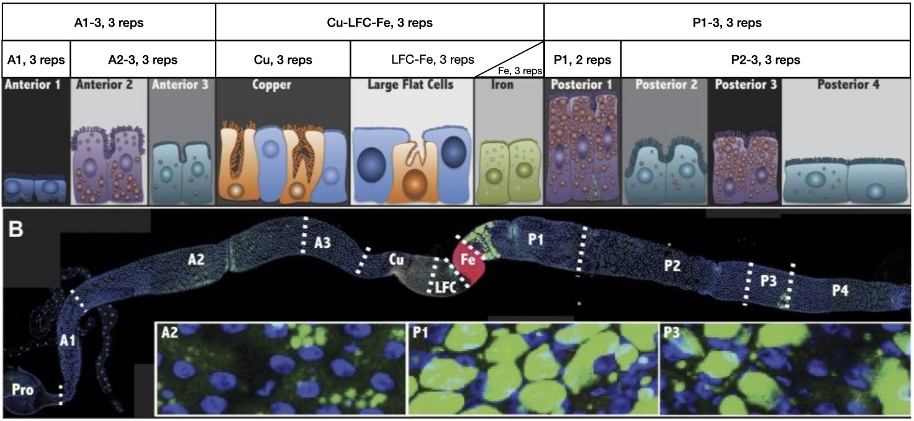

# Bulk RNA-seq, PCA, and clustering

## Assignment Overview

Today, you will be examining gene expression data from a paper by our own Allan Spradling entitled ["Physiological and stem cell compartmentalization within the Drosophila midgut"](https://pubmed.ncbi.nlm.nih.gov/23991285/). The data are RNA-seq samples derived from Drosophila melanogaster midguts cut into nine sections. Some samples cover multiple regions, as denoted by their sample names (see the image below). Each sample has three replicates.



 In some study designs, you may want to "model out" or account for the effects of certain predictor variables (termed "covariates") while focusing attention on other predictors. From the statistical perspective, covariates are typically treated in the same way as other predictor variables, we simply place less focus on their effects in downstream analysis and interpretation as they may be less relevant to our key hypotheses.

In this exercise, you will be focusing on three tasks. First, you will use Fastqc to examine the quality of the fastq data. Next, you will use the quality report from the RNA processing pipeline to assess the quality of the mapped samples. Finally, you will do some initial exploratory analysis and clustering to explore the data. Because of the scale of the data and time-comsuming nature of processing the fastq reads into gene quantitation, the data have already been processed using the Nextflow rnaseq pipeline.


Code from the live-coding session can be downloaded [here](https://raw.githubusercontent.com/bxlab/cmdb-quantbio/refs/heads/main/assignments/lab/bulk_RNA-seq_part1/slides_asynchronous_or_livecoding_resources/Live_coding.R)

<br>


## Data

The data you will be utilizing today come in three parts. The first is a pair of subsetted fastq files (`sample_1.fq.gz` and `sample_2.fq.gz`) corresponding to the forward and reverse reads for the A1 sample, replicate 1. Second, you will have a folder (`multiqc`) containing an html file and suppourting data detailing a variety of quality metrics about the processed data. Lastly, you will have a table of transcript counts (`salmon.merged.gene.gene_counts.tsv`) for each gene (rows) and sample (columns). 

To get the data, download them from [here](https://raw.githubusercontent.com/bxlab/cmdb-quantbio/refs/heads/main/assignments/lab/bulk_RNA-seq_part1/extra_data/bulkRnaSeqData.tar.gz). You can use the following commands to download and unpack the data:

```bash
wget https://raw.githubusercontent.com/bxlab/cmdb-quantbio/refs/heads/main/assignments/lab/bulk_RNA-seq_part1/extra_data/bulkRnaSeqData.tar.gz
tar -xzf bulkRnaSeqData.tar.gz
```

<br>


## Exercises

There are three exercises in this assignment:

1. Use fastqc to determine the quality of the reads prior to RNA-seq analysis (~20 minutes)
2. Use the multiqc report to explore the quality of the processed data (~15 minutes)
3. Data exploration and visualization using DESeq2 (~2 hours)

> **_Important:_** Note that in any code snippets shown in the assignment, variable names are examples only and you will need to use the variable names from your own code when applying the functions or operations!

<br>

## Submission

Before you begin, create a `week5` folder in your `QBB2024-answers` repo. You will be expected to turn in 5 files for this assignment.

1. A README.md file containing answers to questions from sections 1.1, 1.2, 2, 3.3, 3.6
2. An R script for processing the gene counts and creating the required plots
3. A PCA plot from section 3.3
4. A Heatmap plot from section 3.5 
5. A gene ontology report from section 3.6

<br>


### Exercise 1: Checking fastq quality

In this section, you will be using `fastqc` to check the quality of the sample reads prior to processing.


#### **Step 1.1**: Open `fastqc` and load both sample files from the _File_ menu.

Within your `qb24` conda environment, you should be able to start `fastqc` by typing its name into the command line and pressing enter. This will bring up a graphical interace. You can load the sample data by selecting _open_ under the _File_ menu. Be sure to select both sample fastq files.

Click through the different metrics. Do any stand out as problematic? Remember that `fastqc` is meant for DNA sequences from across the genome.

**Can you think of a reason why this sample does not match the expected GC content distribution and base content at the beginning of sequences?**


#### **Step 1.2**: Overrepresented sequences

You may also notice that there are several overrepresented sequences in these sample reads. `Blast` provides a handy tool for determining if a sequence matches any sequences in NCBI's database of sequences from a large set of species. Use the `blast` [web interface](https://blast.ncbi.nlm.nih.gov/Blast.cgi?PROGRAM=blastn&PAGE_TYPE=BlastSearch&LINK_LOC=blasthome) to determine if you can identify what the most overrepresented sequence us from

**What is the origin of the most overrepresented sequence in this sample? Does it make sense?**

<br>


### Exercise 2: Using MultiQC to check processed data quality

While it does not analyze the data directly, `MultiQC` takes the output of a variety of programs including fastqc, aligners, samtools, bamtools, and many more and compiles them into a web-based report. To open the report, open a new tab in your favorite web browser and then from the _File_ menu select _open_. Select the file `multiqc_report.html` from the multiqc folder.

**If you were to reject any samples with the percentage of unique reads less than 45%, how many samples would you keep?**

Given that replicate are contiguous (next to each other) in the sample ordering, examine the DESeq2 sample-to-sample distance heatmap.

**Can you see the blocks of triplicates clearly? Try adjusting the min slider up. Does this suggest anything about consistency between replicates?**

<br>


### Exercise 3: Normalization and clustering

Now you are going to explore the data using some tools provided in `DESeq2`, an RNA-seq analysis package in R. You can use the live-coding session to help scaffold this session.

#### **Step 3.1**: Loading and filtering the data

Before loading the data, you will first need to load the following libraries:

- DESeq2
- vsn
- matrixStats
- readr
- dplyr
- tibble
- ggfortify

Now, using the `readr::read_tsv` function, load the file `salmon.merged.gene_counts.tsv`. You will want to use the column `gene_name` as the row names. You will also want to use `dplyr::select` to remove the column `gene_id`.

DESeq2 expects count data so it will only accept integers. Unfortunately there are some decimal numbers in the data so you will need to convert each column from type _numeric_ to type _integer_. This can be done using the function `dplyr::mutate_if`, the condition `is.numeric`, and the argment `as.integer`.

Keep rows with at least 100 reads. You can use the function `rowSums` to sum across rows. Now select only the "narrow region" samples, i.e. those covering midgut sections A1, A2-3, Cu, LFC-Fe, Fe, P1, and P2-4. You can use the function `dplyr::select` to do this.

Make sure to record each step in your R script to turn in.

#### **Step 3.2**: Creating  DESeq2 model and batch-correction

Next you will need to create a `DESeq2` object using the command `DESeqDataSetFromMatrix`. First you will need to create a metadata tibble. This should contain two columns, one with sample names and the other with replicate number. Both should be created as factors by enclosing each list in the tibble creation in the function `as.factor`. For the `DESeq2` object, you will also need to spceify a design.

```R
metadata = tibble(tissue=as.factor(c("A1", "A1", ...)), rep=as.factor(c(1, 2, ...)))
DESeqDataSetFromMatrix(countData=as.matrix(data), colData=metadata, design=~tissue)
```

In order to correct the data for batch-effects, use the function `vst` which stands for variance stabilizing transformation. Finally, plot your data to ensure that the correct removed the relationship between mean and variance with the function `meanSdPlot`. You will need to convert your data inside the function using `assay`:

```R
meanSdPlot(assay(vst_transformed_data))
```

#### **Step 3.3**: PCA analysis

Perform PCA on the corrected data and plot it. Save the plot to turn in.

```R
pca_data = plotPCA(data, intgroup=c("rep","tissue"), returnData=TRUE)
ggplot(pca_data, aes(PC1, PC2, color=tissue, shape=rep)) +
  geom_point(size=5)
```

Examine the PCA plot. Does everything look okay (We wouldn't ask if it did)?

**What does the PCA plot suggest to you about the data? Why?**

Fix any problems that the PCA reveals. There are two strategies for this. The first is to change the metadata and rerun the DESeq object creation and correction. The other is convert the data into a matrix with `as.matrix(assay(data))`, which you will need to do in the next step anyway. Then use indexing to rearrange things. If you opt for the latter solution, you will also need to fix the colnames.


#### **Step 3.4**: Filtering genes by variance

If you haven't already done so, convert your vst-corrected data from step 3.2 into a matrix using the command `as.matrix(assay(data))`. You are now going to create a version of the data with each set of replicates averaged. This can be accomplished with the following code that cycles through all 21 samples, selecting every third sample. You will then find the standard deviation for each gene (row):

```R
combined = data[,seq(1, 21, 3)]
combined = combined + data[,seq(2, 21, 3)]
combined = combined + data[,seq(3, 21, 3)]
combined = combined / 3
sds = rowSds(combined)
```
 
Using these standard deviations, keep only genes with a standard deviation greater than 1. This should ensure that you are not looking at genes with consistent (or absent) expression across all of the samples.


#### **Step 3.5**: K-means clustering genes

Using your gene-filtered data, you will be clustering the genes into 12 clusters using k-means clustering. To ensure it is replicable, first set the seed to 42, then perform the clustering. To get the cluster labels from the cluster object returned by `kmeans`, use `$cluster`.

Using the cluster labels, sort the rows of your gene-filtered data matrix and then the cluster labels themselves. Now visualize your clusters by plotting the data as a heatmap, using the labels to color each cluster.

```R
heatmap(data, Rowv=NA, Colv=NA, RowSideColors=RColorBrewer::brewer.pal(12,"Paired")[labels])
```

Save this plot to turn in.


#### **Step 3.6**: Gene ontology enrichment analysis

 Get the gene names using `rownames` for all genes in cluster 1. Copy these and paste them into the web tool [Panther](https://geneontology.org/) to perform a gene ontology enrichment analysis. Make sure "biological process" is selected and select the correct genome.

 From the export options on the results page, click "Table" to download the results and submit this file.

 **Do the categories of enrichments make sense? Why?**

<br>

## Grading

1. R script for exploratory analysis of expression data **(4.5 points total)**
  * Loads data, converts to integers, filters by row sums **(0.5 points)**
  * Creates DESeq2 object and normalizes by VST **(1 point)**
  * Performs PCA **(0.5 points)**
  * Fixes data issue with tissue labels correct **(1 point)**
  * Performs k-means clustering and reordering based on clusters **(1 point)**
  * Saves gene names from cluster 1 **(0.5 points)**
2. `README.md` file with answers to questions **(3.5 points total)**
  * Answer to question for part 1.1 **(0.5 points)**
  * Answer to question for part 1.2 **(0.5 points)**
  * Answer to questions for part 2 **(1 points)**
  * Answer to questions for part 3.3 **(1 points)**
  * Answer to questions for part 3.6 **(0.5 points)**
3. Plots **(2 point total)**
  * PCA plot with point shape and color denoting tissues/replicates **(1 point)**
  * Heatmap showing 12 clusters denoted by color **(1 point)**
4. GO analysis report **(1 points total)**


**Total Points: 10**

<br>

## Advanced Exercises:

Assuming you successfully implemented the above steps, you should be able to see that there is something fishy in the GO analysis of cluster 1. Explain what you think is causing this.

Explore GO enrichments for other clusters and see if anything else of interest catches your eye.

<br>

## Additional Resources

Here are some awesome resources for you. We don't expect you to read these all, but they're relevant for discussions we had in today's lecture and could be helpful for you in your future research.

* [RNA-sequencing overview](https://www.nature.com/articles/s41576-019-0150-2). Figure 2 is especially useful and presents some of the quantification steps/tools that we haven't shown you.
* [Specific example pipeline](https://www.nature.com/articles/nprot.2016.095) from Steven Salzberg & Co, commonly used in previous iterations of bootcamp
* [Batch effects](https://www.biorxiv.org/content/10.1101/025528v1.full.pdf) discussion from Stephanie Hicks, specifically concerning single cell RNAseq
* [Replicates vs Depth](https://academic.oup.com/bioinformatics/article/30/3/301/228651) and the relation to statistical power

