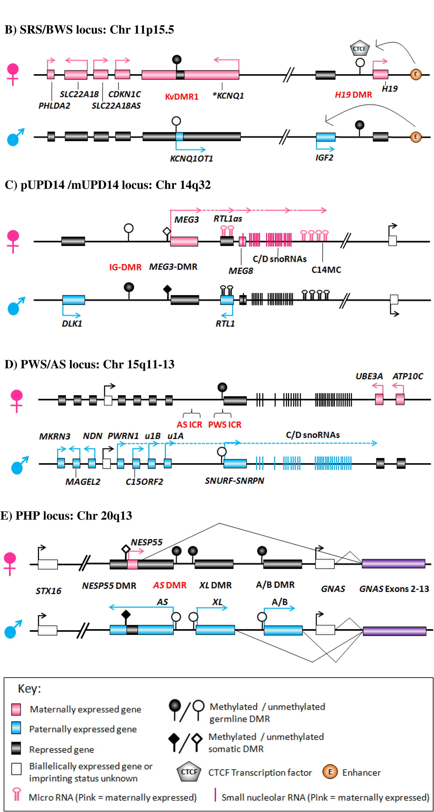

# Assignment 7: Nanopore Sequencing and Methylation
Assignment Date: Friday, Oct. 28, 2022 <br>
Due Date: Friday, Nov. 4, 2022 @ 1:00pm ET <br>

## Lecture

[Lecture slides](https://github.com/bxlab/cmdb-quantbio/raw/main/assignments/lab/nanopore-seq/slides_asynchronous_or_livecoding_resources/Nanopore.pdf)

## Assignment Overview

For this lab, you will be working with nanopore data from Oxford Nanopore. The data were basecalled to identify methylated cytosine in addition to standard sequence. Reads for four regions have been extracted along with their corresponding methylation calls. If you look at the entries in the bam file, you will see that there is an additional pair of tags, MM and ML, followed by a series of comma-separated numbers. These values are the base counts between methylated bases and methylation call probabilities, respectively.

 The aim of this assignment is to identify differential methylation at several known imprinted genes from the paper [The role of imprinted genes in humans](https://pubmed.ncbi.nlm.nih.gov/22771538/). Observing figure 2 (below), you can see a series of regions with differential methylation.

 

For each of these regions, create an image from IGV showing reads separated by parent and highlighting their methylation patterns. There are several steps needed to achieve this.

1. Call and phase variants for each region
2. Mark reads with the correct haplotype tag
3. Split reads into two files by haplotype
4. Set up a conda environment for and build the latest version of `IGV`
5. Load data into IGV and set up methylation-specific viewing parameters
6. Locate differentially-methylated feature(s) and save an image for each region

### Part 0a: Setting up your conda environment

In order to call variants and phase them, you will be using two programs, Medaka and whatshap. You will need to create a conda environment to do this.

```bash
conda create -n Medaka medaka -y
```

This will install most of what you need. Once you have activated this environment, you will need to replace the current version of whatshap, as there is an incompatibility with the installed version. Unfortunately you can't do this with `conda` so you will need to use the following command instead:

```bash
pip install whatshap==1.0
```

This will force an updated version of whatshap to be installed. When you run this command, it will complain that whatshap is not the correct version but will install anyway. Ignore these warnings.

### Part 0b: Getting the data

All of the data is downloadable in a compressed archive. To download and unpack it, use the command:

```bash
curl https://bx.bio.jhu.edu/data/msauria/cmdb-lab/ont_data.tar.gz --output ont_data.tar.gz
tar xzf ont_data.tar.gz
```

This will give you 5 files:

- methylation.bam - your methylation-called reads
- methylation.bam.bai - the index for your bam file
- methylation.bed.gz - a compressed bed file containing methylation sites
- methylation.bed.gz.tbi - the index for the compressed bed file
- regions.bed - a bed file containing the regions that were used to filter the data and that you will be considering in this assignment
- region_genes.bed - a bed file containing genes for chromosomes 11, 14, 15, and 20

You will also need a copy of the human genome, since using it directly from your data directory will complain about write privileges.

```bash
cp /Users/cmdb/data/genomes/hg38.fa ./
```

### Part 1: Call and phase variant for each region

To call variants, you will be using `medaka_variant`. Unfortunately, like many newer tools `medaka_variant` does not have good documentation. In fact, I have found the help statement (argument `-h`) to be the most helpful.

To call variants, Medaka needs to know which model was used to do the basecalling, both for variant calling and phasing. You should use the default for both `-s` and `-m`. You will also need the phased vcf file as output (look at `-p`). Only one region can be specified for Medaka at a time so you will need to generate a phased vcf file for each region in `regions.bed` using the format `chr:start-end` to specify the region.

### Part 2: Mark reads with the correct haplotype tag

The next step is to assign reads a haplotype. To do this, you will be using `whatshap haplotag`. As in the previous step, you will be doing this for each region independently. There is an error in the `whatshap` usage information about the format of specifying a region. You need to use the format `chr:start:end`. There is also a quirk that the `whatshap haplotag` command will freeze if the first argument passed is not `-o OUT_FNAME` where OUT_FNAME is a filename to save the phased bam file to. You will need to output a haplotag list for the splitting step input. Finally, note that the VCF file needed for input should be the compressed and indexed one from the medaka output (i.e. ending in `.gz`).

### Part 3: Split reads into two files based on their haplotype

Once you have tagged the reads, you will need to split the bam file into two bam files, one for each haplotype. You will be using `whatshap split`, performing the split for each region independently. Use `whatshap split` and the haplotag list that you just generated.

While you can complete the `igv` part of the assignment with the region- and haplotype-specific bam files, it is easy to concatenate them into one bam file per haplotype using `samtools cat` (samtools is **not** in the igv environment, so you will need to do this before the next step if you decide to concatenate the bam files).

### Part 4: Setting up IGV

You will need to install a new version of `IGV` for this assignment as the functionality for viewing methylation data without reprocessing bam files was only recently added. To do this, you will be creating a new conda environment, cloning the `IGV` repo and building the application.

```bash
conda deactivate
conda create -n igv gradle openjdk=11 -y
conda activate igv
git clone https://github.com/igvteam/igv.git
```

Once you have cloned the repo, change into the igv directory and use the following command to build the program:

```bash
cd igv
./gradlew createDist
cd ../
```

This will create a new executable in the folder `igv/build/IGV-dist/igv.sh`. For convenience, I suggest creating a symlink (like an alias) in your homework directory.

```bash
ln -s ${PWD}/igv/build/IGV-dist/igv.sh ./
```

Now, when you want to start `IGV`, simply type `./igv.sh`.

### Part 5: Configuring IGV for differential methylation

Finally, you will be visualizing your data in `IGV` (the new one you just installed).  Once you have loaded the haplotype-specific bam files, you will need to change the coloring scheme to display the embedded methylation data. To do this, two-finger click on each track and then select `Color alignments by->base modification (5mC)`. For information about interpreting this diplay mode, see [here](https://github.com/igvteam/igv/wiki/5mC-coloring-mode).

### Part 6: Find and plot differentially methylated regions

For each region, you should locate one of the differentially-methylated features shown in the above figure. Zoom in and center the feature in the IGV window such that it takes up approximately the middle fifth of the window. Save a `.png` of the zoomed and centered IGV window using the `File -> Save Image` menu command.

- Do you expect each region in H1 or H2 to correspond to the same parent of origin (i.e. the same haplotype)? Explain your reasoning.

## Submission

For this assignment you should turn in a record of commands you used to do the assignment, your answer to the question in part 6, and one igv image for each region (4 in all).

## Advanced

Using the `region_genes.bed` file provided, find the mean methylation signal across each gene body and its corresponding mean signal in the 1K region upstream of the TSS and create a scatterplot showing this relationship. The function `bedtools map` is very handy for this.
