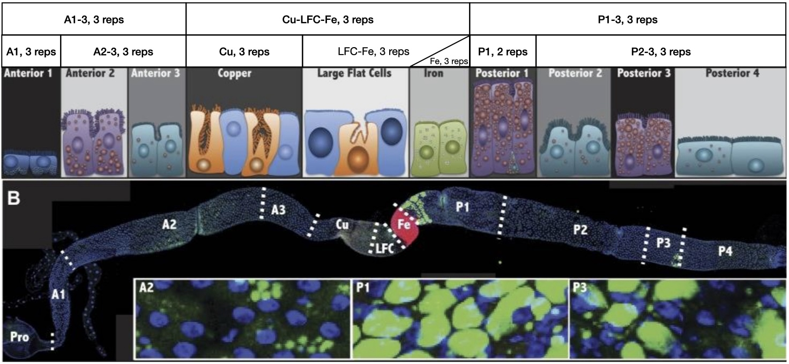

# Unsupervised learning

## Assignment Overview

Today, you will be examining gene expression data from a paper by our own Allan Spradling entitled ["Physiological and stem cell compartmentalization within the Drosophila midgut"](https://pubmed.ncbi.nlm.nih.gov/23991285/). The data are RNA-seq samples derived from Drosophila melanogaster midguts cut into nine sections and processed with Salmon and DESeq2. Some samples cover multiple regions, as denoted by their sample names (see the image below). Each sample has three replicates.



In today's assignment, you will be using unsupervised machine learning methods to explore the data for both quality and bioligical insights.

<br>


## Data

The data you will be utilizing today were processed using the Nextflow RNA-seq pipeline utilizing Salmon and then normalized using a variance-stabilizing transformation in DESeq2. You will be downloading a table of transformed gene expression values with one row per gene and one column per sample replicate (7 tissues x 3 replicates for 21 colunns).

To get the data, download them from [here](https://raw.githubusercontent.com/bxlab/cmdb-quantbio/refs/heads/main/assignments/lab/unsupervised_learning/extra_data/read_matrix.tsv.gz). You can use the following commands to download and unpack the data:

```bash
wget https://raw.githubusercontent.com/bxlab/cmdb-quantbio/refs/heads/main/assignments/lab/unsupervised_learning/extra_data/read_matrix.tsv.gz
gunzip read_matrix.tsv.gz
```

<br>


## Exercises

There are three exercises in this assignment:

1. Use principle component analysis to investigate the variability and relationship between samples and replicates
2. Use k-means clustering to find groups and genes with similar expression profiles across samples
3. Perform gene-ontology analysis on these gene clusters to identify enriched molecular pathways in specific clusters

<br>


## Submission

Before you begin, create a `week6` folder in your `QBB2025-answers` repo. You will be expected to turn in 7 files for this assignment.

1. A README.md file containing answers to questions from sections 1.3 and 3
2. An R script for processing the gene counts and creating the required plots
3. A PCA plot from section 1.3
4. A scree plot (% variance explained) from section 1.3 
5. A Heatmap plot from section 2.2
6. 2 gene ontology reports from section 3

<br>


### Exercise 1: PCA analysis

#### **Step 1.1**: Loading and filtering the data

Begin by loading the data into R. You will want to make sure the data are in a matrix as opposed to a dataframe so you can use the `as.matrix` function to do this conversion.

For the PCA analysis you will only want to use the most variable genes. You can use the function `rowSds` to find the standard deviation of each gene. Select the top 500 most variant genes for running the PCA. You will want to keep the whole dataset for downstream analysis so make a new copy of the data when filtering.

#### **Step 1.2**: Run the PCA analysis

To perform PCA, you will use the function `prcomp`. This function expects samples in rows so you will need to invert your matrix (you can use the transpose function `t` to do this).

The returned PCA object has several types of information. The transformed data into PC coodinates are in a matrix `x` with samples corresponding to rows and principal components corresponding to columns (for example, to access the first and second PC coordinates for the first sample, you would use `data$x[1,1:2]` where `data` is the object returned by `prcomp`). The PCA object also contains the amount of variance explained by each principal component in the attribute `sdev` (i.e. `data$sdev`).

#### **Step 1.3**: Plot the first two PCs and plot the amount of variance explained for each PC

Plot each sample using its first two PC coordinates. To do this, you will need to create a new tibble (dataframe) with columns corresponding to the first and second PCs as well as the sample names. Make sure to include a legend and if you can, use color to denote tissue and point shapes to denote replicate number. To do this, you can use the function `tidyr::separate` to split the sample names into two columns, tissue and replicate.

Save this plot to turn in.

Examine the PCA plot. Does everything look okay (We wouldn't ask if it did)?

**What does the PCA plot suggest to you about the data? Why?**

Fix any problems that the PCA reveals.

**What feature explains the first principal component (simply saying "tissue" is not sufficient)?**

Also plot the amount of variance explained by each PC as a bar chart. As always, remember to label your axes.

Save this plot to turn in.

### Exercise 2: K-means clustering

#### **Step 2.1**: Averaging and filtering genes by variance

You are now going to create a version of the data with each set of replicates averaged. This can be accomplished with the following code that cycles through all 21 samples, selecting every third sample:

```R
combined = data[,seq(1, 21, 3)]
combined = combined + data[,seq(2, 21, 3)]
combined = combined + data[,seq(3, 21, 3)]
combined = combined / 3
```

 You can now find the standard deviation for each replicate-averaged gene (row). Using these standard deviations, keep only genes with a standard deviation greater than 1. This should ensure that you are not looking at genes with consistent (or absent) expression across all of the samples.

#### **Step 2.2**: K-means clustering genes

Using your gene-filtered data, you will be clustering the genes into 12 clusters using k-means clustering. To ensure it is replicable, first set the seed to 42 (`set.seed`), then perform the clustering. Use the argument `nstart=100` to select the best result out of 100 random starting configurations. To get the cluster labels from the cluster object returned by `kmeans`, use `$cluster`.

Using the cluster labels, sort the rows of your gene-filtered data matrix and then the cluster labels themselves. Now visualize your clusters by plotting the data as a heatmap, using the labels to color each cluster.

```R
heatmap(data, Rowv=NA, Colv=NA, RowSideColors=RColorBrewer::brewer.pal(12,"Paired")[labels], ylab="Gene")
```

Save this plot to turn in.

### Exercise 3: Gene ontology enrichment analysis

 Select two clusters to investigate. For each, get the gene names using `rownames` , filtering for only genes within the cluster you have selected. Copy these and paste them into the web tool [Panther](https://geneontology.org/) to perform a gene ontology enrichment analysis. Make sure "biological process" is selected and select the correct genome. If your cluster does not have any significant enrichments, select a different cluster.

 From the export options on the results page, click "Table" to download the results and submit this file.

 **Do the categories of enrichments make sense? Why?**

<br>


## Grading

1. R script for analysis and plotting **(4 points total)**
  * Performs PCA **(1 point)**
  * Fixes data issue with tissue labels correct **(1 point)**
  * Performs k-means clustering and reordering based on clusters **(1 point)**
  * Saves gene names from selected clusters **(1 points)**
2. `README.md` file with answers to questions **(2 points total)**
  * Answer to first question for part 1.3 **(0.5 points)**
  * Answer to second question for part 1.3 **(0.5 points)**
  * Answer to question for part 3 **(1 point)**
3. Plots **(3 points total)**
  * PCA plot with point shape and color denoting tissues/replicates **(1 point)**
  * Scree plot **(1 point)**
  * Heatmap showing 12 clusters denoted by color **(1 point)**
4. GO analysis reports **(1 point total)**


**Total Points: 10**

<br>


## Advanced Exercises:

Different clustering methods are suited for different types of problems. Run PCA on the filtered set of data that you used for K-means clusting and apply the k-means cluster labels as colors. How well do the clusters partition the data when viewed this way?

Alternatively, you can use a hierarchical clustering approach to performed an unsupervised analysis (creating a tree). This is done automatically with the `heatmap` function but you turned it off using `Rowv=NA`. Run the heatmap plotting again but include the dendrogram (tree) to see how these 2 approaches differ in their clustering of the data. Which one visually makes more sense?
