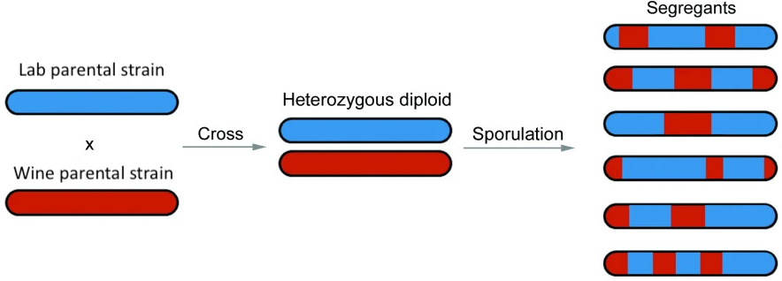

# Variant Calling

## Assignment Overview

Modern genome sequencing technologies produce sequencing "reads" which represent subsequences of the fragmented DNA molecules isolated in an experiment. One of the first steps in nearly all genomic analyses is to align (or "map") the reads to a reference genome and identify sites where your samples vary from the reference. This lab is designed to practice and explore this basic approach.

To accomplish this goal, we will be working with Illumina short-read sequencing data generated in a study where a lab strain of a model yeast species (_Saccharomyces cerevisiae_) was crossed with a wine strain as part of an experiment to map associations between genotypes and phenotypes (paper: "[Finding the sources of missing heritability in a yeast cross](http://www.nature.com/nature/journal/v494/n7436/full/nature11867.html)"). The diploid offspring from this cross were sporulated, and a colony from one haploid spore from each of the resulting tetrads was sequenced. This means that the data you will be working with are yeast _segregants_-- haploid genomes that we expect will be mosaics of the two original strains (i.e., will possess long "tracts" of ancestry from one strain versus the other; see figure below). This experimental approach is common in the field of yeast quantitative genetics.



## Data

##### **Sequencing reads**

We have randomly selected ten samples from the study and placed them in a compressed file on Dropbox. You can download the data into your current directory and decompress them with the following commands:

```bash
wget https://www.dropbox.com/s/ogx7nbhlhrp3ul6/BYxRM.tar.gz
tar -xvzf BYxRM.tar.gz
```

As always, if your `.gitignore` is not already set up to ignore these FASTQ files, you should update it so that they are ignored. **You should NOT be uploading any of these files.**


## Exercises

Remember to record all of your work! You can answer the questions using comments within your scripts. Show how you obtained your answers.

Plan to submit:
- a Bash script for exercise 1 (with comments providing answers to written questions; see example below).

<h5 a><strong><code>ex1.sh</code></strong></h5>

```bash
#!/usr/bin/env bash

### Question 1.1 ###

my unix commands | to perform | Q1.1 analysis here
# A written answer to Question 1.1 based on the output of my code above can go here here.


### Question 1.2 ###

my unix commands | to perform | Q1.2 analysis here
# A written answer to Question 1.2 based on the output of my code above can go here here.

...
```


- a Bash script for exercise 2 (with comments providing answers to written questions)
- a Python script for exercise 3 to produce output necessary for your figures
- an R script to produce figures for exercise 3 (with comments providing answers to written questions)
- the figures themselves as PNG files

### Exercise 1: Get to know your data

Take a glance at the first file, `A01_09.fastq`. These are single-end whole-genome DNA sequencing data from an Illumina sequencer. Use your knowledge of FASTQ files (see Mike Sauria's previous lecture) and the UNIX commands you have learned from previous classes to answer the following questions:

**Question 1.1**: How long are the sequencing reads?

**Question 1.2**. How many reads are present within the file?

**Question 1.3**: Given your answers to 1 and 2, as well as knowledge of the length of the S. cerevisiae reference genome, what is the expected average depth of coverage?

**Question 1.4**: While you do not need to repeat for all samples, looking at the size of the files can give us information about whether we have similar amounts of data from other samples. Use the `du` command to check the file sizes of the rest of the samples. Which sample has the largest file size (and what is that file size, in megabytes)? Which sample has the smallest file size (and what is that file size, in megabytes)?

**Question 1.5**: Run the program FastQC on your samples (with default settings). Open the HTML report for sample `A01_09`. 

What is the median base quality along the read? How does this translate to the probability that a given base is an error? Do you observe much variation in quality with respect to the position in the read? 


### Exercise 2: Map your reads to the reference genome

#### **Step 2.1**: Download and index the sacCer3 genome

You'll be using a tool called `bwa` ([BWA manual](http://bio-bwa.sourceforge.net/bwa.shtml)) to perform alignment. Before you can align your sequencing reads, `bwa` needs you to index the sacCer3 genome. Without getting into the details, this essentially means creating a table of contents (and index) that `bwa` can use to quickly find matches between your reads and the reference genome.

First, download the sacCer3 reference genome FASTA file from UCSC and unzip it:

```bash
wget https://hgdownload.cse.ucsc.edu/goldenPath/sacCer3/bigZips/sacCer3.fa.gz
gunzip sacCer3.fa.gz
```

Then, using `bwa index`, create an index for the `sacCer3.fa` reference.

```bash
bwa index sacCer3.fa
```

As always, if your `.gitignore` is not already set up to ignore these files (reference genome and indices), you should update it so that they are ignored. **You should NOT be uploading any of these files.**

**Question 2.1**: How many chromosomes are in the yeast genome?


#### **Step 2.2**: Align your reads to the reference

Now that you've indexed the reference, you can align your reads to the reference using `bwa mem`. Because you'll want to run this step the same way on all 10 strains, it makes sense to do this step in a bash `for` loop (check your notes from last week!).

Create a bash `for` loop that loops through each of the 10 samples. For each sample, use `bwa mem` to align the reads to the reference. 

**IT IS IMPORTANT** that you assign each sample a read group during this process, so that individual samples can be distinguished later. You can do this with the (somewhat cryptic) `-R` flag, which you use to add a line to the header of each output alignment file. An example of a header line you can add with the `-R` flag is `"@RG\tID:Sample1\tSM:Sample1"`. You can replace "Sample1" here with the appropriate sample name for each of your yeast strains.

Perhaps consider the `-t` flag as well.

#### **Step 2.3**: Sanity check your alignments

Now that you've aligned your reads to the reference, you should have 10 `.sam` files, one for each sample. These files contain all of the alignments for each yeast strain. You can see how they're organized with `less -S`, and you can read more about the SAM format [here](https://samtools.github.io/hts-specs/SAMv1.pdf).

Using various Unix commands, answer the following questions about the `A01_09` SAM file:

**Question 2.2**:  How many total read alignments are recorded in the SAM file?

**Question 2.3**:  How many of the alignments are to loci on chromosome III?


#### **Step 2.4**: Format and index your alignments

These files contain all of the information you need for variant calling, but before you can do that, they'll need to be sorted and indexed (similar to how you indexed the reference in Step 1. For both of these tasks you can use the `samtools` program (manual [here](http://www.htslib.org/doc/samtools.html), or you can just run `samtools help`).

**First**, sort each of your `.sam` files using `samtools sort`. You can do this in a new `for` loop in your bash script or, even better, in the same `for` loop you used for alignment. You'll want to output these sorted files as `.bam` files, which contain the same information as the `.sam` file but are compressed.

Perhaps consider the `-O` and `-o` flags when running `samtools sort`. 

**Next**, create an index for each of the resulting sorted `.bam` files using `samtools index`. As before, you can do this in a new `for` loop in your bash script or in the same `for` loop as the previous two steps.

At the end of this step, you should have 10 sorted `.bam` files and their corresponding `.bam.bai` indices.

#### **Step 2.5**: Visualize your alignments

Open IGV and set the SacCer3 genome as the reference. Load the sample `A01_09` in IGV ("File" -> "Load from File..."). Zoom in far enough to see the reads and scan through some alignments.

**Question 2.4**: Does the depth of coverage appear to match that which you estimated in Step 1.3? Why or why not?

**Question 2.5**: Set your window to `chrI:113113-113343` (paste that string in the search bar and click enter). How many SNPs do you observe in this window? Are there any SNPs about which you are uncertain? Explain your answer.

**Question 2.6**: Set your window to `chrIV:825548-825931`. What is the position of the SNP in this window? Does this SNP fall within a gene?


### Exercise 3: Variant discovery and genotyping

Now that you've aligned the sequencing reads to the reference genome, you can call genetic variants across the yeast strains. The most widely used program for this purpose is called GATK. I am confident that you could figure out how to use GATK given enough time, but we would spend the whole class debugging esoteric details of this specific program. To save you the effort, I therefore went ahead and called variants using an alternative program called FreeBayes, followed by a bit of quality filtering and adjustment of formatting.

That file can be obtained via Dropbox [here](https://www.dropbox.com/scl/fi/9kpzomh4uor2z5z7q5i82/biallelic.vcf?rlkey=mc2m37gnntajiptp51cvwb28x&dl=0). If you are curious how it was generated, please see the following code, which you are welcome to (but not required) replicate on your own computer.

```bash
# generate a list of the bam files
ls *.bam > bamListFile.txt

# run FreeBayes to discover variants
freebayes -f sacCer3.fa -L bamListFile.txt --genotype-qualities -p 1 > unfiltered.vcf

# the resulting VCF file is unfiltered, meaning that it contains low-confidence calls and also has some quirky formatting, so the following steps use a software suite called vcflib to clean up the VCF

# filter the variants based on their quality score and remove sites where any sample had missing data
vcffilter -f "QUAL > 20" -f "AN > 9" unfiltered.vcf > filtered.vcf

# FreeBayes has a quirk where it sometimes records haplotypes rather than individual variants; we want to override this behavior
vcfallelicprimitives -kg filtered.vcf > decomposed.vcf

# in very rare cases, a single site may have more than two alleles detected in your sample; while these cases may be interesting, they may also reflect technical errors and also pose a challenge for parsing the data, so I opted to remove them
vcfbreakmulti decomposed.vcf > biallelic.vcf

```


### Exercise 3: Exploratory data analysis

Now that you have discovered and genotyped variants in your samples, you would like to do some basic exploratory analysis of the patterns you observe in the VCF. 

You will be creating figures that explore the following features of the data:
- The allele frequency spectrum of the discovered variants
- The distribution of read depth across sample genotypes

Create an empty `ex3.py` script now where you'll be doing the analyses in the next steps.<br><br>

#### **Step 3.1**: Parse the VCF file

For these analyses, you'll have to parse the VCF file that we provided. If you can find a python library that handles VCF parsing, you're welcome to use it, but it may be easier to simply use the following structure:

```python
for line in open(<vcf_file_name>):
    if line.startswith('#'):
        continue
    fields = line.rstrip('\n').split('\t')

    # grab what you need from `fields`
```

Each of the following analyses needs information from a different field/column from the VCF. As such, you'll be grabbing multiple pieces of information from each line, so if you do use this structure, instead of looping through the VCF separately for each analysis, try to use just a single loop across all analyses.

Remember, you can read more about the VCF file format [here](https://samtools.github.io/hts-specs/VCFv4.2.pdf).<br><br>

#### **Step 3.2**: Allele frequency spectrum

Using your Python script above, extract the allele frequency of each variant and output it to a new file called `AF.txt` which contains only the allele frequencies -- one per line (potentially having the first line contain a header). This information is pre-calculated for you and can be found in the variant specific INFO field. Check the file header to decide which ID is appropriate. This is a per-variant metric, so with 10 variants and 5 samples, you would only have 10 allele frequencies.

Plot a histogram showing the allele frequency spectrum (distribution) of the variants in the VCF. 

Make sure you label the panel appropriately. Set `bins=11` to avoid binning artifacts.

**Question 3.1**: Interpret this figure in two or three sentences in your own words. Does it look as expected? Why or why not? Bonus: what is the name of this distribution?

#### **Step 3.2**: Read depth distribution

Using your Python script above, extract the read depth of each variant site in each sample and output it to a new file called `DP.txt` which contains only the depths -- one per line (potentially having the first line contain a header). This information can be found in the sample specific FORMAT fields and the end of each line. Check the file header to decide which ID is appropriate. This is a per-sample, per-variant metric, so with 10 variants and 5 samples, you would have 50 read depths.

Plot a histogram showing the distribution of read depth at each variant across all samples (i.e., a single histogram, rather than multiple histograms stratified by sites or samples).

Make sure you label the plot appropriately. Set `bins=21` and `xlim(0, 20)` to make the figure more legible, noting that some very high depths will be cut off.

**Question 3.2**: Interpret this figure in two or three sentences in your own words. Does it look as expected? Why or why not? Bonus: what is the name of this distribution?


### Optional advanced exercise 4: Ancestry inference

Consider the experimental design and examine the figure posted in the Assignment Overview section of this page. Note that the reference genome sacCer3 is itself derived from the lab strain. The implication is that regions of the segregant genomes that derive from the lab strain should be largely devoid of SNPs, whereas regions of the segregant genome that derive from the wine strain should be enriched for SNPs.

#### **Step 4.1**: Visualize data in IGV

Load all 10 sample BAM files into IGV simultaneously. Set the browser to `chrIV:192829-205454`.

**Question 4.1**: Which samples do you think derive from the lab strain and which samples do you think derive from the wine strain in this region of the genome?


#### **Step 4.2**: Infer sample ancestry

Select a single sample and using the VCF, extract:
- the chromosome of the variant
- the position of the variant
- the genotype of your sample (reference `0` or alternative `1`)

For a given chromosome (or all chromosomes) for your sample, create a figure where the x axis is the position and you use either a color or the y axis to represent whether the genotype was a 0 or a 1.

**Question 4.2**: Do you notice any patterns? What do the transitions indicate?

## Submission

1. Bash script that performs the explorations of the FASTQ file for exercise 1 (**2.5 points (0.5 per question)**).

2. Bash script that performs the alignments, formatting, indexing, and answers to questions from exercise 2 (**3 points (0.5 per question)**).

3. Python script to produce the output necessary for plots in Step 3 (**2.5 points**).

4. R script to take the output from step 3 and generate figures, which should also be uploaded (**2 points**).


**Total Points: 10**

