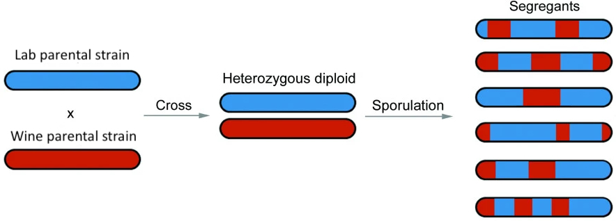

# Read Mapping and Variant Discovery

## Overview

Modern genome sequencing technologies produce sequencing "reads" which represent subsequences of the fragmented DNA molecules isolated in an experiment. To make sense of these reads, we first align (or "map") them to a reference genome. Once we know where each read came from, we can identify sites where a sample differs from the reference. By comparing patterns of variation across a sample of genomes, we can infer ancestry relationships and locate historical recombination events (i.e., genome shuffling during meiosis).

You will work with Illumina short-read sequencing data from a cross between a lab strain of *Saccharomyces cerevisiae* (BY) and a wine strain (RM), as described in the paper ["Finding the sources of missing heritability in a yeast cross"](http://www.nature.com/nature/journal/v494/n7436/full/nature11867.html). Diploid offspring from this cross were sporulated, and a colony from one haploid spore from each tetrad was sequenced. The data therefore represent *segregants*: haploid genomes that are mosaics of the two parental strains.



Over the course of this assignment you will map reads for 10 segregants, inspect and summarize the resulting alignments, discover variants, and use those variants to infer which parts of each genome came from which parent.

### Learning objectives

- Align short sequencing reads to a reference genome using [bwa mem](https://bio-bwa.sourceforge.net/bwa.shtml)
- Understand the contents of [SAM/BAM files](https://samtools.github.io/hts-specs/SAMv1.pdf) and summarize them with `samtools`
- Visualize alignments in [IGV](https://igv.org/doc/desktop)
- Discover and filter variants, producing a [VCF file](https://samtools.github.io/hts-specs/VCFv4.2.pdf)
- Explore and interpret variant data using Python and R

## Instructions

- Work in `~/qbXX-answers/weekX`
- Document your Unix commands and your answers to the written questions in a `README.md`
- `git push` after each exercise
- The sequencing data and alignment files are large. Add them to your `.gitignore` so that you do not upload them. **Do not commit `.fq.gz`, `.sam`, `.bam`, or `.bam.bai` files.**
- Strive to organize your directory, e.g.

    ```
    /Users/cmdb/qb25-answers/week2
    ├── README.md
    ├── genomes
    │   └── sacCer3.fa
    └── variants
        ├── A01_09.bam
        ├── A01_09.bam.bai
        ├── A01_09.sam
        └── ...
    ```

## Preparation

The [BYxRM dataset](http://genomics-pubs.princeton.edu/YeastCross_BYxRM) should already be on your machine. Confirm that `ls -l ~/Data/BYxRM` matches

```
-rw-r--r--   1 cmdb  staff  23729508 May  6  2024 BYxRM_GenoData.txt
-rw-r--r--   1 cmdb  staff    797659 May  6  2024 BYxRM_PhenoData.txt
drwxr-xr-x  98 cmdb  staff      3136 Jul 30 15:13 fastq
```

The `fastq` directory holds sequencing reads for many segregants, named `A01_01.fq.gz`, `A01_02.fq.gz`, and so on. We will use 10 of them.

`~/Data/BYxRM/BYxRM_GenoData.txt` contains genotype calls that the original authors produced from these same data. We will use it later as a point of comparison. Skim it with `less`

```
marker                 A01_01  A01_02
27915_chr01_27915_T_C  R       B
28323_chr01_28323_G_A  R       B
28652_chr01_28652_G_T  R       B
29667_chr01_29667_C_A  R       B
```

Each row is a marker and each column is a segregant. `B` means the segregant carries the BY (lab strain) allele at that marker and `R` means it carries the RM (wine strain) allele.

---

## Exercise 1: Map reads to the reference genome

Place all of your code for this exercise in a bash script called `map_reads.sh`.

### Step 1.1: Prepare the reference genome

An aligner cannot search a reference genome efficiently by reading it front to back every time. Instead, it builds an *index*, a data structure that lets it jump directly to candidate locations for a given sequence. You only need to build the index once per reference genome.

```bash
cd genomes
cp ~/Data/References/sacCer3/sacCer3.fa.gz .
gunzip sacCer3.fa.gz
bwa index sacCer3.fa
```

This will produce several new files next to `sacCer3.fa` with extensions such as `.bwt` and `.sa`. You will never open these yourself. `bwa` finds them automatically as long as they sit beside the FASTA file.

### Step 1.2: Map one sample

Before writing a loop, run the aligner once by hand on a single sample so that you can see what it produces.

```bash
cd ../variants
bwa mem -t 4 -R "@RG\tID:A01_09\tSM:A01_09" ../genomes/sacCer3.fa ~/Data/BYxRM/fastq/A01_09.fq.gz > A01_09.sam
```

Taking that command apart:

| Piece | What it does |
| --- | --- |
| `bwa mem` | The alignment algorithm. `mem` is the bwa algorithm intended for reads of ~70 bp and longer. |
| `-t 4` | Use 4 threads. This makes the alignment run faster on a laptop with multiple cores. |
| `-R "..."` | Attach a *read group* label to every read from this sample. See the box below. |
| `../genomes/sacCer3.fa` | The indexed reference genome. |
| `~/Data/BYxRM/fastq/A01_09.fq.gz` | The reads to align. `bwa` reads gzipped FASTQ files directly, so there is no need to decompress them first. |
| `> A01_09.sam` | `bwa mem` prints alignments to the screen by default, so redirect them into a file. |

> **About the `-R` read group argument**
>
> A read group is a tag that travels with each read and records which sample it came from. Downstream programs (including the variant caller you will use in Exercise 3) read this tag to decide which reads belong to which sample. Without it, a variant caller given several BAM files has no way to tell your samples apart.
>
> The argument is a single string made of fields separated by tab characters:
>
> ```
> @RG     ID:A01_09     SM:A01_09
> ```
>
> - `@RG` announces that this is a read group line
> - `ID` is a unique identifier for this batch of reads
> - `SM` is the sample name, which is what will eventually appear as a column header in your VCF
>
> You cannot type a literal tab on the command line (pressing Tab triggers filename completion), so you write `\t` instead and let `bwa` interpret it. **The quotation marks are required.** Without them, bash strips the backslashes and `bwa` receives `@RGtID:A01_09tSM:A01_09`, which is not a valid read group. If your alignments later appear to have no sample name, check the quotes first.
>
> For our purposes `ID` and `SM` can both simply be the sample name.

### Step 1.3: Sort, convert, and index

A SAM file is plain text, and the alignments in it come out in whatever order the reads appeared in the FASTQ file. Most downstream tools want a BAM file (the compressed binary version of SAM) sorted by genomic position, accompanied by an index so that they can pull out a specific region without reading the whole file.

```bash
samtools sort -@ 4 -O bam -o A01_09.bam A01_09.sam
samtools index A01_09.bam
```

You should now have `A01_09.bam` and `A01_09.bam.bai`.

**Question 1.1**: Use `ls -lh` to compare the sizes of `A01_09.fq.gz`, `A01_09.sam`, and `A01_09.bam`. Why is the SAM file so much larger than the FASTQ file it came from? Why is the BAM file so much smaller than the SAM file?

### Step 1.4: A short detour on variables and loops

You have now run three commands for one sample. Those three commands contain the sample name in seven separate places. Running them nine more times by hand, editing all seven each time, is exactly the kind of task where people make silent mistakes. Instead you will write a script.

> **Variables in bash**
>
> A variable is a name that stands for a piece of text. You create one with `=` and **no spaces around the equals sign**, and you get the text back out by putting `$` in front of the name:
>
> ```bash
> my_sample=A01_09
> echo ${my_sample}
> ```
>
> This prints `A01_09`.
>
> The curly braces are optional in simple cases but always safe, so get in the habit of using them. They tell bash exactly where the variable name ends. Without them, `$my_sample_sorted` looks to bash like a variable named `my_sample_sorted`, which does not exist, and you get an empty string instead of an error.
>
> Wherever `${my_sample}` appears in a command, bash swaps in the text *before* running the command. So this:
>
> ```bash
> my_sample=A01_09
> samtools index ${my_sample}.bam
> ```
>
> is exactly the same as typing `samtools index A01_09.bam`.
>
> One detail that matters below: variables expand inside **double** quotes but not inside single quotes. `"SM:${my_sample}"` becomes `SM:A01_09`, while `'SM:${my_sample}'` stays as the literal characters `SM:${my_sample}`. This is why the read group argument uses double quotes.

A `for` loop sets a variable to each value in a list, one at a time, and runs the commands between `do` and `done` once for each value. Try this harmless version first, at the command line, to watch it work:

```bash
for my_sample in A01_09 A01_11 A01_23
do
    echo "Now processing" ${my_sample}
done
```

You should see three lines of output. Nothing else happened, because `echo` only prints.

### Step 1.5: Build a workflow for all 10 samples

Now do the same thing for all 10 segregants. Complete the loop below in `map_reads.sh`. The alignment step is already written for you, but look carefully at where `${my_sample}` appears in it.

```bash
#!/bin/bash

# the 10 segregants we will analyze
for my_sample in A01_09 A01_11 A01_23 A01_24 A01_27 A01_31 A01_35 A01_39 A01_62 A01_63
do
    echo "***" ${my_sample}

    # align reads to the reference genome
    bwa mem -t 4 -R "@RG\tID:${my_sample}\tSM:${my_sample}" ../genomes/sacCer3.fa ~/Data/BYxRM/fastq/${my_sample}.fq.gz > ${my_sample}.sam

    # sort the alignments by position and convert to BAM
    ___________

    # index the BAM file
    ___________
done
```

Run the script. When it finishes you should have 10 `.bam` files and 10 `.bam.bai` files. This will take several minutes, so feel free to start it and read ahead.

**Question 1.2**: `${my_sample}` appears four times in the `bwa mem` command. Write out that command exactly as bash would run it on the *third* trip through the loop, with every variable replaced by its value.

**Submit**: `map_reads.sh`, and your answers to Questions 1.1 and 1.2 in `README.md`.

---

## Exercise 2: Look at and summarize your alignments

Before trusting any result that comes out of an alignment file, it is worth opening one up and seeing what is actually inside.

### Step 2.1: Read a SAM file by eye

A SAM file has two parts: a header, where every line begins with `@`, and then one line per alignment. Look at the header first.

```bash
samtools view -H A01_09.bam
```

You should see `@SQ` lines (one per chromosome in the reference), an `@RG` line, and a `@PG` line.

**Question 2.1**: What do the `@SQ` lines tell you, and how many are there?

Now look at a few actual alignments.

```bash
samtools view A01_09.bam | head -n 3
```

Each line has 11 mandatory tab-separated fields followed by any number of optional tags. The first few are:

| Column | Name | Meaning |
| --- | --- | --- |
| 1 | QNAME | Read name, taken from the FASTQ file |
| 2 | FLAG | A number encoding a set of yes/no facts about the alignment |
| 3 | RNAME | Chromosome the read aligned to |
| 4 | POS | Leftmost position of the alignment (1-based) |
| 5 | MAPQ | Mapping quality: confidence that this is the right location |
| 6 | CIGAR | Compact description of matches, insertions, and deletions |
| 10 | SEQ | The read sequence |
| 11 | QUAL | Per-base quality scores |

**Question 2.2**: Pick one alignment from the output above. What chromosome and position did it align to, and what is its CIGAR string? What does that CIGAR string mean?

**Question 2.3**: Your read group appears twice: once in the `@RG` header line, and once as an `RG:Z:` tag among the optional tags at the end of each alignment. Find both. Where did those values come from, and why does every single read need to carry one?

### Step 2.2: Summarize the alignments with `samtools flagstat`

Reading alignments one at a time is useful for understanding the format but useless for judging whether a run worked. `samtools flagstat` walks through the whole file and tallies the FLAG field.

```bash
samtools flagstat A01_09.bam > A01_09.flagstat
cat A01_09.flagstat
```

**Question 2.4**: What fraction of reads mapped to the reference genome? Is that a reasonable number for a yeast sample aligned to the yeast reference?

**Question 2.5**: Several lines of the output are exactly 0, including "properly paired" and "with mate mapped to a different chr". Why? What does that tell you about how this library was sequenced?

### Step 2.3: Visualize the alignments in IGV

- Open IGV.app and switch to the "S. cerevisiae (sacCer3)" genome in the top left menu
    - If it is not available, select "Download Hosted Genome..." from the Genomes menu
- Load all 10 of your `.bam` files at once
- Navigate to `chrI:27,000-32,000`
- Save the view with File > Save PNG Image... as `alignments.png`

Recall that the sacCer3 reference genome was built from the BY lab strain. A segregant whose reads match the reference in this region probably inherited it from BY, and a segregant whose reads show many mismatches probably inherited it from RM.

**Question 2.6**: Looking at your 10 samples in this region, which ones appear to carry BY ancestry and which appear to carry RM ancestry? Find the markers at chrI:27915, chrI:28323, chrI:28652, and chrI:29667 in `~/Data/BYxRM/BYxRM_GenoData.txt` and check whether your visual call agrees with the published genotypes.

**Submit**: `A01_09.flagstat`, `alignments.png`, and your answers to Questions 2.1 through 2.6 in `README.md`.

---

## Exercise 3: Variant discovery

Place all of your code for this exercise in a bash script called `call_variants.sh`.

Now that you have alignments for all 10 segregants, you can look for sites where they differ from the reference. You will use [FreeBayes](https://github.com/freebayes/freebayes), a variant caller that considers all samples at once.

### Step 3.1: List your BAM files

FreeBayes accepts a file containing one BAM file name per line. Generate a list of your 10 BAM files and name it `bamListFile.txt`. Its first lines should look like this:

```
A01_09.bam
A01_11.bam
A01_23.bam
...
```

### Step 3.2: Call and filter variants

Some of these commands are a bit esoteric, so most of the steps are provided below. Fill in the missing pieces, indicated by `_________`.

Think about the `-p` argument carefully. It sets the ploidy, and these segregants are haploid.

```bash
# run FreeBayes to discover variants
freebayes -f _________ -L _________ --genotype-qualities -p _________ > unfiltered.vcf

# the resulting VCF file is unfiltered, meaning that it contains low-confidence calls and also has
# some quirky formatting, so the following steps use a software suite called vcflib to clean it up

# filter the variants based on their quality score and remove sites where any sample had missing data
vcffilter -f "QUAL > 20" -f "AN > 9" unfiltered.vcf > filtered.vcf

# FreeBayes has a quirk where it sometimes records haplotypes rather than individual variants;
# we want to override this behavior
vcfallelicprimitives -kg filtered.vcf > decomposed.vcf

# in very rare cases, a single site may have more than two alleles detected in your sample; while
# these cases may be interesting, they may also reflect technical errors and pose a challenge for
# parsing the data, so we remove them
vcfbreakmulti decomposed.vcf > biallelic.vcf
```

These commands take a long time to run. Start them in a separate terminal window if you like, but **use this copy of the output for the remaining exercises so that you are not blocked**: [biallelic.vcf](https://www.dropbox.com/scl/fi/9kpzomh4uor2z5z7q5i82/biallelic.vcf?rlkey=mc2m37gnntajiptp51cvwb28x&st=g6xits13&dl=0)

**Question 3.1**: Open the VCF with `less -S` and look at the header lines beginning with `##`. Then find the `#CHROM` line. What are the last 10 columns, and where did those names come from?

**Question 3.2**: Why does the ploidy argument matter here? What would a genotype look like if you had told FreeBayes these samples were diploid?

**Submit**: `call_variants.sh`, `bamListFile.txt`, and your answers to Questions 3.1 and 3.2 in `README.md`.

---

## Exercise 4: Ancestry inference

Think back to the experimental design and the figure in the Overview. The sacCer3 reference genome is itself derived from the BY lab strain. Regions of a segregant genome that came from BY should therefore mostly carry alleles matching the reference, while regions that came from RM should be enriched for alternative alleles. In Exercise 2 you saw this by eye in IGV for one 5 kb window. Now you will do it genome-wide.

You will write one Python script, `ex4.py`, that reads the VCF a single time and writes two files:

- `AF.txt`, the allele frequency of each variant, for a quick look at the variants themselves
- `gt_long.txt`, the genotype of every sample at every variant, which is what the ancestry figures are built from

### Step 4.1: Parse the VCF file

If you can find a Python library that handles VCF parsing you are welcome to use it, but it may be easier to build your script around the following structure:

```python
for line in open(<vcf_file_name>):
    if line.startswith('#'):
        continue
    fields = line.rstrip('\n').split('\t')

    # grab what you need from `fields`
```

Rather than reading the file once for each output, open both output files before the loop and write to each one inside it.

Skip variants on `chrM` entirely. The mitochondrial genome is not inherited the way the nuclear chromosomes are, so it does not belong in either analysis, and it will make a mess of your faceted plot later.

You can read more about the VCF file format [here](https://samtools.github.io/hts-specs/VCFv4.2.pdf).

### Step 4.2: Allele frequency spectrum

Write the allele frequency of each variant to `AF.txt`, one per line (a header line is fine). This value is pre-calculated for you in the variant-specific INFO field, which is column 8. Open the VCF with `less -S` and read the `##INFO` header lines to decide which ID is the one you want.

The INFO field packs many values into one string, separated by semicolons:

```
AB=0;ABP=0;AC=3;AF=0.3;AN=10;AO=19;CIGAR=2X;DP=119;...
```

You already know the tool for taking a string apart. Split it on `;` to get the individual entries, then split each entry on `=` to separate its name from its value.

This is a per-variant metric, so a VCF with 20 variants and 10 samples would give you 20 allele frequencies, not 200.

Use R to plot a histogram of the allele frequencies. Label the panel appropriately and set `bins=11` to avoid binning artifacts. Save the figure as `AF.png`.

**Question 4.1**: Interpret this figure in two or three sentences in your own words. Does it look as expected? Why or why not? Bonus: what is the name of this distribution?

### Step 4.3: Convert the genotypes to long format

Each line of `gt_long.txt` should contain:

- the sample ID
- the chromosome of the variant
- the position of the variant
- the genotype of that sample (reference `0` or alternative `1`)

Here is some pseudocode for the part that goes inside your loop:

```
    if the line starts with "#CHROM":
        # this line lists the sample names, starting at column 10
        sample_ids = fields[9:]

    if the line starts with "#":
        skip it, as these are metadata

    chrom = fields[0]
    pos   = fields[1]

    # for each sample in sample_ids:
        # get that sample's data from fields[9], fields[10], ...
        # the genotype is the first value before ":" in that sample's data
        # if the genotype is "0" then print "0"
        # if the genotype is "1" then print "1"
        # otherwise skip
```

Pull the sample names out of the `#CHROM` line rather than typing them by hand. The samples do not appear in the VCF in the same order you listed them in `bamListFile.txt`, so a hardcoded list is an easy way to silently mislabel every genotype in your output.

A small number of genotypes in this VCF are missing, recorded as `.` rather than `0` or `1`. That is what the final "otherwise skip" is for.

### Step 4.4: Visualize one sample and one chromosome

For chrII of sample A01_62, create a figure where the x axis is position and color indicates whether the genotype was a 0 or a 1. Make sure to convert the genotype to a factor variable.

**Question 4.2**: Do you notice any patterns? What do the transitions indicate?

### Step 4.5: Expand your visualization

Now use `facet_grid` to plot all chromosomes for sample A01_62. Use the `scales = "free_x"` and `space = "free_x"` options to allow different x-axis scales for different chromosomes.

Then extend the plot to include all 10 samples. Different samples do not need their own facets. They can simply be arranged along the y axis, which can accept variables that are not numeric. Save the figure as `ancestry.png`.

**Question 4.3**: Do the samples that looked like BY in your IGV screenshot from Exercise 2 also look like BY at the left end of chrI here? Do any samples appear to be mostly one parent across the whole genome?

**Submit**: `ex4.py`, `ex4.R`, `AF.png`, `ancestry.png`, and your answers to Questions 4.1 through 4.3 in `README.md`.

---

## Exercise 5 (optional extension): Detecting meiotic crossovers

One of the most important aspects of meiosis is crossover recombination. In these yeast segregants, each haploid genome contains multiple **crossover events**, visible as switches from long tracts of BY ancestry to long tracts of RM ancestry, or vice versa.

### Step 5.1: Write code to detect crossovers

Write `ex5.py` to read `gt_long.txt` and find the places where a sample's ancestry switches from 0 to 1 or from 1 to 0.

**Question 5.1**: Do you think a single "discordant" SNP is sufficient to call a crossover? Why or why not?

Adjust your approach accordingly, then:

- Count the number of crossover events per sample
- Record these counts in a text file called `crossovers.txt`

Three hints, since this is the trickiest code in the assignment:

- Handle one sample at a time. Loop over the samples on the outside, and inside that loop read `gt_long.txt` from the top, skipping every line that does not belong to the sample you are working on. Reading the file once per sample is wasteful, but it keeps you from having to hold all ten samples in your head at once.
- The variants in `gt_long.txt` are already in position order within each chromosome, so you do not need to sort anything.
- Reset whatever you are tracking whenever the chromosome changes. A tract of ancestry cannot continue from the end of one chromosome onto the start of the next, and if you forget this you will count a spurious crossover at most chromosome boundaries.

### Step 5.2: Make a histogram

In R, create a histogram showing the number of crossovers per segregant across the 10 samples. Save it as `crossovers.png`.

**Question 5.2**: What does the distribution of crossovers look like? Published estimates for this system are roughly 90 crossovers per meiosis. Each crossover involves two of the four chromatids, so a single spore should carry about half that number. How does your estimate compare, and if it is off, in which direction and why?

**Submit**: `ex5.py`, `ex5.R`, `crossovers.txt`, `crossovers.png`, and your answers to Questions 5.1 and 5.2 in `README.md`.

---

## Submission summary

1. `README.md` with your commands and your answers to all written questions
2. `map_reads.sh` — bash script to align, sort, and index all 10 samples
3. `A01_09.flagstat` — output of `samtools flagstat`
4. `alignments.png` — IGV image of chrI:27,000-32,000
5. `call_variants.sh` — bash script to produce the VCF
6. `bamListFile.txt` — list of BAM files
7. `ex4.py` and `ex4.R` — VCF parsing, allele frequency spectrum, and ancestry plots
8. `AF.png` and `ancestry.png` — figures
9. Optional: `ex5.py`, `ex5.R`, `crossovers.txt`, `crossovers.png`

Remember that `.fq.gz`, `.sam`, `.bam`, and `.bam.bai` files should be excluded by your `.gitignore` and should not be uploaded.
