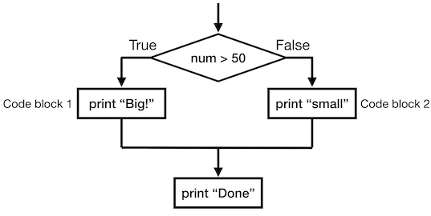

# Python Fundamentals - part 2

---

# Overview

### In this section, we will be covering

- Passing information to your Python program
- Decision making
- While loops
- Dictionaries
- Creating functions
- Understanding errors and exceptions
- Defensive programming

---

# Command line arguments

### Information we may want to pass from the command line

---

## Command line arguments

### Information we may want to pass from the command line

- file names
- variables
- options
- data from other programs

---

## Command line arguments

In the previous Python lecture, you were introduced to lists. Let's look at a special list, the *command line arguments*.

When you run a Python script, everything from the command line used to run the script is stored as a list in a special variable, *sys.argv*.

 

---

Let's write a short program that prints out the values in *sys.argv* and call it **argv.py**.

	!python
	import sys
	# this library contains all sorts of built in functionality in Python

	arguments = sys.argv
	print(arguments)

---

Let's write a short program that prints out the values in *sys.argv* and call it **argv.py**.

	!python
	import sys
	# this library contains all sorts of built in functionality in Python

	arguments = sys.argv
	print(arguments)

Now, if we run this script, what should we see?

	!bash
	> python argv.py

---

Let's write a short program that prints out the values in *sys.argv* and call it **argv.py**.

	!python
	import sys
	# this library contains all sorts of built in functionality in Python

	arguments = sys.argv
	print(arguments)

Now, if we run this script, what should we see?

	!bash
	> python argv.py
	["argv.py"]

---

What about if we want to get everything from the command line except the name of our script (presumably we already know that)? 

Here is our command line call:

	!bash
	> python argv.py arg1 arg2 arg3

And here is what we want our program to print:

	!bash
	["arg1", "arg2", "arg3"]

---

Here is our command line call:

	!bash
	> python argv.py arg1 arg2 arg3
	["arg1", "arg2", "arg3"]

We can use something like 

	!python
	import sys

	print(sys.argv[1:])
	# We use the empty argument on the right side of the index
	# since we don't know how many arguments there are

---

# Decision Making

or

### How I stopped worrying and learned to love the conditional

Obviously our scripts are of limited use if they can do only one things without responding to different inputs or circumstances. Luckily, there's an app for that.

We can ask Python to check conditions to decide what code to execute or skip with a set of commands: *if*, *else*, and *elif*. Let's see how they work.

---

## Conditional Statements

Let's consider the following script:

	!python
	# myscript.py
	
	num = 37
	if num > 50:
		print("Big!")
	else:
		print("Small.")
	print("done")

What should we see as the output?

---

## Conditional Statements

Let's consider the following script:

	!python
	# myscript.py

	num = 37
	if num > 50:
		print("Big!")
	else:
		print("Small.")
	print("Done")
###
	!bash
	> python myscript.py
	Small.
	Done

---
## Conditional statements

So, what is happening? If we think of our script this way:

	!python
	num = 37             # Input value
	if num > 50:		 # Conditional test, branch 1
		print("Big!")    # 1st block of code
	else:				 # Conditional test, branch 2
		print("Small.")  # 2nd block of code
	print("Done")		 # unconditioned block of code

---

## Conditional Statements

If we need more possible outcomes, we could add additional nested if statements.

	!python
	# myscript.py

	num = 37
	if num > 50:
		print("Big!")
	else:
		if num < 50:
			print("Small.")
		else:
			print("Equal")
	print("Done")

This can make for harder to read code and more difficult to follow logic.

---

## Conditional Statements

If we wanted more nuance, we could add additional conditions using *elif*. This stands for "else if" but means that we don't have to keep adding nested if statements.

	!python
	# myscript.py

	num = 37
	if num > 50:
		print("Big!")
	elif num < 50:
		print("Small.")
	else:
		print("Equal")
	print("Done")

Note that you can have more than one *elif* statement but the *else* must be the last part of the conditional code. It is essentially the default option.

---

## Conditional operators

There are several ways to compare values in Python.

- == (is equal to)
- != (is not equal to)
- \> (greater than)
- < (less than)
- \>= (greater than or equal to)
- <= (less than or equal to)

---

## That's not what I meant

You can reverse the value of any boolean in Python with the keyword *not*

Looking at our previous script

	!python
	num = 37
	if num > 50:
		print("Big!")
	elif not num > 50:  # This is the same logic as above, but negated
		print("Small.")
	else:
		print("Equal")
	print("Done")

---

## How *if* evaluates the conditional argument(s)

The *if* command simply looks to see if the argument is true or false. This means you can pass a statement of any complexity so long as it resolves to *True* or *False*

For example:

	!python
	if 1 > 2 or 2 < 3:
		print("True")

What do each of the parts of the conditional statement resolve as? Together?

---

## How *if* evaluates the conditional argument(s)

In our example:

	!python
	if 1 > 2 or 2 < 3:
		print("True")

1. (1 > 2) is False
2. (2 < 3) is True
3. (False or True) is True

So, the code will print "True"

---

## How *if* evaluates the conditional argument(s)

One nice thing is that as Python is evaluating the conditional statement, if it sees that the value will resolve to be True or False regardless of what comes next in the statement, it stops looking.

	!python
	a = []
	if len(a) > 0 and a[0] > 3:
		print("Big")

	a.append(5)
	if len(a) > 0 and a[0] > 3:
		print("Big")

This is useful in cases where a condition might result in an error if we haven't done something yet, like define a variable or try to index outside the bounds of a list or array.

---

## Other useful conditional statements

There are several other really useful statements that evaluate to a boolean that you can use in an *if* statement.

- *in*

This keywork lets you check if something is in a list (and other things which we will get to)

	!python
	a = [1, 2, 3]
	if 1 in a:         # This will evaluate as True
		print("True")

---

## Other useful conditional statements

There are several other really useful statements that evaluate to a boolean that you can use in an *if* statement.

- *in*

This keywork lets you check if something is in a list (and other things which we will get to)

	!python
	a = [1, 2, 3]
	if 1 in a:         # This will evaluate as True
		print("True")

- The string method *.startswith()* and *.endswith()*

If you want to check a string's value but don't care about matching the whole string, it can be useful to just check the start or end

	!python
	a = "# header line"
	if a.startswith("#"):  # This will evaluate as True
		print("header")
	if a.endswith("#"):    # This will evaluate as False
		print("false")

---

## Conditional evaluation of other data types

You can also evaluate other variables, like integers, strings, and lists as booleans.

- Integer and decimal values less than or equal to zero evaluate as False
- Empty lists and strings evaluate as False

Take for example the following code:

	!python
	a = [1, 2]
	if len(a) > 0:
		print("list isn't empty")
	if not a:
		print("list is empty")

How would the second *if* statement resolve?

---

## Conditional evaluation of other data types

You can also evaluate other variables, like integers, strings, and lists as booleans.

- Integer and decimal values less than or equal to zero evaluate as False
- Empty lists and strings evaluate as False

Take for example the following code:

	!python
	a = [1, 2]
	if len(a) > 0:
		print("list isn't empty")
	if not a:
		print("list is empty")

How would the second *if* statement resolve?

- *a* evaluates as True
- *not a* evaluates to False

---

## Conditional coding exercise

Instead of an exact match, think about how you would check for "close enough".

Try writing a conditional statement that checks whether *a* is within 10% of *b*.

---

## Conditional coding exercise

Try writing a conditional statement that checks whether *a* is within 10% of *b*.

	!python
	if a < b * 0.9:
		print("False")
	elif a > b * 1.1:
		print("False")
	else:
		print("True")

	if (a - b) / b >= -0.1 or (a - b) / b <= 0.1:
		print("True")
	else:
		print("False")

	if max(a - b, b - a) / b <= 0.1:
		print("True")
	else:
		print("False")

---

# The while loop

Sometimes you will need to loop through data but won't know for how long. In this case, a *for* loop is not appropriate. That is where the *while* loop comes in. It's like a *for* loop and *if* statement had a baby together.

The *while* loop consists for two parts.

1. A conditional statement to test whether to execute the code block inside the loop
2. A block of code within the loop that will eventually lead to the conditional statement evaluating to False (if not, you'll be in the loop **forever**)

---

## The while loop

Here is a simple example of a *while* loop:

	!python
	counter = 0
	while counter < 5:
		counter += 1
		print(counter)

Like the *if* and *for* statements, the *while* statement ends with a *:* and the block of code inside the loop is indented.

What should the output of this script be?

---

## The while loop

Here is a simple example of a *while* loop:

	!python
	counter = 0
	while counter < 5:
		counter += 1
		print(counter)

Like the *if* and *for* statements, the *while* statement ends with a *:* and the block of code inside the loop is indented.

What should the output of this script be?

	1
	2
	3
	4
	5

---

## The while loop

Sometimes you want to exit a *while* loop without getting to the beginning of the loop, or for a condition other than the one tested in the *while* statement. In this case, you can use the *break* command.

	!python
	a = 0
	while a < 10:
		a += 1
		if a == 4:
			break 
	print(a)

The *break* will immediately exit a loop without executing any more of the code within the loop. It can also be used with *for* loops.

What do you think the above code would print?

---

## The while loop

Sometimes you want to exit a *while* loop without getting to the beginning of the loop, or for a condition other than the one tested in the *while* statement. In this case, you can use the *break* command.

	!python
	a = 0
	while a < 10:
		a += 1
		if a == 4:
			break 
	print(a)

The *break* will immediately exit a loop without executing any more of the code within the loop. It can also be used with *for* loops.

What do you think the above code would print?

	4

---

## When to use the while loop

What situations might a *while* loop be useful?

---

## When to use the while loop

What situations might a *while* loop be useful?

- When you have code that may take a variable number of executions that you don't know before running it

For example, if you are estimating a parameter and getting closer and closer, you could use a *while* loop with a stop condition of "error < something"

---

## While exercise

Write a *while* loop to find the first power of 2 (2^1, 2^2, etc.) that is greater than 1000 (no cheating and using logarithms).

---

## While exercise

Write a *while* loop to find the first power of 2 (2^1, 2^2, etc.) that is greater than 1000 (no cheating and using logarithms).

	!python
	power = 0
	while 2 ** power < 1000:
		power += 1
	print(power)

And the result:

	10

---

# A new data structure - Dictionaries

So far we've seen one way to collect data together, *lists*. Let's look at another data structure, *dicts*, short for dictionaries.

---

## A new data structure - Dictionaries

Unlike lists, entries in dictionaries are comprised of 2 parts, a "key" and a "value". To create a dictionary, we can use the function *dict()*.

	!python
	my_dictionary = dict(
		key1: value1,
		key2: value2,
		key3: value3)
	print(my_dictionary[key2])

First, notice that each entry has a *key*, *:*, and then a *value*. Second, just like indexing with numbers to get a specific value from a list, we use indexes with dictionaries. However, these indexes are the keys, not just position values.

Note: we can also use a short-cut notation to create/indicate that something is a dictionary.

	!python
	my_dictionary = {key1: value1,...}

---

## Dictionaries vs. Lists

While they are both variable containers, there are several key differences between lists and dictionaries.

**Lists**

	- Ordered, the values in a list are always in the same order
	- Position indexed; to get a value from a list, you use [position] to retrieve it
	- Can contain anything in each position
	- The same value can appear as many times as you want in the list
	- Slower to determine if a particular value is in the list

---

## Dictionaries vs. Lists

While they are both variable containers, there are several key differences between lists and dictionaries.

**Lists**

	- Ordered, the values in a list are always in the same order
	- Position indexed; to get a value from a list, you use [position] to retrieve it
	- Can contain anything in each position
	- The same value can appear as many times as you want in the list
	- Slower to determine if a particular value is in the list

**Dictionaries**

	- Unordered, think of your key-value pairs as jumbled up in a bag
	- Key-indexed; to get a value from a dictionary, you use [key] to retrieve it
	- Can contain anything as a value
	- Keys can only be unchangable (immutable in the comp sci lingo).
	- Can contain the same value as many times as you want
	- Each key must be unique
	- Very fast to check if a key exists in a dictionary and get its value

---

## Dictionaries vs. Lists

A practical exercise

---

## Dictionary Uses

What do we need another data structure for? What uses might a dictionary have that a list would be bad at?

---

## Dictionary Uses

What do we need another data structure for? What uses might a dictionary have that a list would be bad at?

- Counting how many times we've seen something
- Being able to quickly check if a value is in our data structure
- Mapping from one set of values to another (think translating from one language to another)
- Keeping track of data where the order will be inconsistent or some values may not appear

---

## A note on immutables

Immutable means "can't be changed". In Python, this means that a variable is immutable if changing its value will overwrite it with the new value.

Everything we've looked at so far is immutable, except lists and dictionaries. Even strings are recreated anytime they changed.

So, things that can be used as dictionary keys (because they're immutable):

- Ints
- Bools
- Floats
- Strings
- Tuples

Wait, what's a *tuple*??!?!?

---

## Tuples

A tuple is like a list that's been frozen. Once created, it can't be changed. You can make a *list* into a *tuple* with the function *tuple()*. You can also create a tuple directly with the function or the short-hand *(a, b, c, ...)*.

	!python
	a = [1, 2, 3]    # A list, so mutable
	b = tuple(a)     # A tuple, so immutable
	c = (1, 2, 3)    # We can also create tuples directly
	d = {b: a, c: a} # Because b and c are immutable, they can be dictionary keys

---

## A Dictionary exercise

Write a script that will read in a file and create a list of values for "Male" and one for "Female". The file format is:

	Female	4
	Female	9
	Male	1
	Female	11
	Male	3
	...

The first value in each line will always be "Male" or "Female". Try to write the script without using *if*.

---

## A Dictionary exercise

Write a script that will read in a file and create a list of values for "Male" and one for "Female".

	!python
	import sys

	fs = open(sys.argv[1])
	data = {"Male": [], "Female": []}
	for line in fs:
		line = line.rstrip().split()
		data[line[0]].append(int(line[1]))

---

## Accessing data in a dictionary

So far, we've seen one way to get values from a dictionary, indexing with the key for the desired value. But what if we want to see everything in a dictionary? Like stepping through a list item by item, there are similar options for iterating through a dictionary.

---

## Accessing data in a dictionary

So far, we've seen one way to get values from a dictionary, indexing with the key for the desired value. But what if we want to see everything in a dictionary? Like stepping through a list item by item, there are similar options for iterating through a dictionary.

### By keys

We can essentially get a a list of keys to step through with the dictionary method *.keys()*

	!python
	mydict = {1: 'a', 2: 'b', 3: 'c'}
	for key in mydict.keys():
		print(key, mydict[key])
###

	1 a
	2 b
	3 c

---

## Accessing data in a dictionary

So far, we've seen one way to get values from a dictionary, indexing with the key for the desired value. But what if we want to see everything in a dictionary? Like stepping through a list item by item, there are similar options for iterating through a dictionary.

### By keys

We can essentially get a a list of keys to step through with the dictionary method *.keys()*

	!python
	mydict = {1: 'a', 2: 'b', 3: 'c'}
	for key in mydict.keys():
		print(key, mydict[key])
###

Note: I say essentially as *mydict.keys()* creates an *iterator*, not a *list*. The only time this distinction is important is if you want to get a list of the keys, in which case you need to explicityly convert it into a list

	keys = list(mydict.keys())

---

## Accessing data in a dictionary

So far, we've seen one way to get values from a dictionary, indexing with the key for the desired value. But what if we want to see everything in a dictionary? Like stepping through a list item by item, there are similar options for iterating through a dictionary.

### By values

We can essentially get a a list of values to step through much like keys with the dictionary method *.values()*

	!python
	mydict = {1: 'a', 2: 'b', 3: 'c'}
	for value in mydict.values():
		print(value)
###

	a
	b
	c

Like with *mydict.keys()*, you will need explicitly convert this to a list if you want a list of values.

---

## Accessing data in a dictionary

So far, we've seen one way to get values from a dictionary, indexing with the key for the desired value. But what if we want to see everything in a dictionary? Like stepping through a list item by item, there are similar options for iterating through a dictionary.

### By keys and values

We can step through with the dictionary getting key-value pairs with the method *.items()*. A tuple will be returned with the pair which we can unpack in the for loop line.

	!python
	mydict = {1: 'a', 2: 'b', 3: 'c'}
	for key, value in mydict.items():
		print(key, value)
###

	1 a
	2 b
	3 c

---

# Defining functions

So far, you have used a variety of functions. Any time you use something in your script immediately followed by parentheses (e.g. print() ), you are using a function.

Let's define our own function. This requires 3 parts:

1. Specifying the name of the function and what parameters should be passed to it, if any
2. What code does the function execute
3. What information does the function return after running

###
	!python
	# Lets define the function max()
	def max(a, b):
		if a >= b:
			val = a
		else:
			val = b
		return val

---

## Defining functions

1. Specifying the name of the function and what parameters should be passed to it, if any
###
	!python
	def max(a, b):

- The *def* tells Python you are about to define a function
- *max* is the name of the function (you can use alphanumeric characters and underscores)
- Inside the parentheses, you give a list of expected parameters. These will be the variable names within the function code
- The *:* indicates that the block of code to follow is the body of the function

---

## Defining functions

2. What code does the function execute
###
	!python
	def max(a, b):
		if a >= b:
			val = a
		else:
			val = b

- Just like *if* statements and *for* loops, the body of the function needs to be indented to indicate which code belongs to the function
- Inside the function you can use the variables that you defined as parameters passed to the function
- You can also create new variables inside the function, but these disappear when the function finishes

---

## Defining functions

3. What information does the function return after running
###
	!python
	return val

- A function can pass back any kind of information you want using the *return* keyword
- You can return multiple things, which will be turned into a list automatically
- If you don't have *return*, the function will end at the end of the code block and return *None*, Python's empty value

---

## Defining functions

You can even include multiple *return* commands, with the function ending as soon as it executes one of them.

For example we could have written the function:

	!python
	# Lets define the function max()
	def max(a, b):
		if a >= b:
			return a
		else:
			return b

This is a little cleaner, but in this case it makes no difference in the way the function acts.

---

## Defining functions

One extension to function parameters that may be useful to know is the *keyword* / *default* parameters. Sometimes we don't need to pass a value for every parameter.

	!python
	def plot_my_data(X, Y, title="", xlabel=""):
		fig = plt.figure()
		fig.plot(X, Y)
		if title:
			fig.set_title(title)
		if xlabel:
			fig.set_xlabel(xlabel)
		plt.show()

In this case, we can pass 2, 4, or 4 arguments. There are only a couple rules:

1. *X* and *Y* must be passed in that order
2. *title* can be passed as the third argument or by using its parameter keyword
3. *xlabel* can be passed as the fourth argument or by using its parameter keyword
4. All unnamed (positional) parameters have to come before keyword parameters

---

## Defining functions

So, given our function **plot_my_data(X, Y, title="", xlabel="")**, here are several ways we could call this function:

	!python
	fig = plot_my_data(X, Y)

	fig = plot_my_data(X, Y, "myplot", "x-axis")

	fig = plot_my_data(X, Y, title="myplot")

	fig = plot_my_data(X, Y, xlabel="x-axis")

---

## Function exercise

In order to practice what you've just learned, try writing your own function to find the area of a rectangle. It should:

1. Take in height and width as parameters
2. If either parameter is omitted, that parameter should have a default value of 1

---

## Function exercise

Hopefully it was clear that in order to have a default value, each parameter also needed a name. A simple solution would be

	!python
	def area(height=1, width=1):
		return height * width

	A = area(3, width=3)
	print(A)  # should print 9

Notice that I used clear names for my function and my parameters. It makes reading and understanding it **MUCH** easier, especially when you return to your own code days or weeks later.

---

## Why use functions

What advantage is there to putting your code in a function?

---

## Why use functions

What advantage is there to putting your code in a function?

1. Your code will be reusable anywhere in your script (or even outside your script)
2. It makes your script easier to read when each task is defined as its own function
3. It makes your code more flexible. Consider a function that accepts another function as a parameter

---

## Why use functions

What advantage is there to putting your code in a function?

1. Your code will be reusable anywhere in your script
2. It makes your script easier to read when each task is defined as its own function
3. It makes your code more flexible. Consider a function that accepts another function as a parameter
###
	!python
	def apply_to_list(data, func):
		result = data[0]
		for i in range(1, len(data)):
			result = func(result, data[i])
		return result

We could use this to sum a list, find the product of the list, find the maximum value of the list, etc.

	!python
	from math import prod # We need to import the function for finding products
	data = [1, 2, 3, 4, 5]
	print(apply_to_list(data, sum)) # prints 15
	print(apply_to_list(data, prod)) # prints 120
	print(apply_to_list(data, max)) # prints 5

---

# Understanding errors and exceptions

It is inevitable that you will have bugs in your code. Luckily Python gives detailed information to help you understand what wrong.

Take the following code as an example:

	!python
	def sum_data(a):
		return a + b

	def run_test():
		data = 120
		result = sum_data(data)
		return result

	run_test()

What will happen when we run this?

---

## Understanding errors and exceptions

	!python
	def sum_data(a):
		return a + b

	def run_test():
		data = 120
		result = sum_data(data)
		return result

	run_test()

We get the output:

	!bash
	Traceback (most recent call last):
	  File ".../error.py", line 9, in <module>
	    run_test()
	  File ".../error.py", line 6, in run_test
	    result = sum_data(data)
	  File ".../error.py", line 2, in sum_data
	    return a + b
	NameError: name 'b' is not defined

---

## Understanding a Traceback

	!bash
	Traceback (most recent call last):
	  File ".../error.py", line 9, in <module>
	    run_test()
	  File ".../error.py", line 6, in run_test
	    result = sum_data(data)
	  File ".../error.py", line 2, in sum_data
	    return a + b
	NameError: name 'b' is not defined

The error Traceback is a map of the chain of events that led to the error in your code. It may be easier to read it from bottom to top to start with.

---

## Understanding a Traceback

	!bash
	Traceback (most recent call last):
	  File ".../error.py", line 9, in <module>
	    run_test()
	  File ".../error.py", line 6, in run_test
	    result = sum_data(data)
	  File ".../error.py", line 2, in sum_data
	    return a + b
	NameError: name 'b' is not defined

1. NameError: name 'b' is not defined

This is the specific kind of error, or "Exception" that occurred. There are several defined exceptions that are built in to Python, but some external libraries define their own.

In this case, Python is telling us that we used a name that the currently executing code doesn't know.

---

## Understanding a Traceback

	!bash
	Traceback (most recent call last):
	  File ".../error.py", line 9, in <module>
	    run_test()
	  File ".../error.py", line 6, in run_test
	    result = sum_data(data)
	  File ".../error.py", line 2, in sum_data
	    return a + b
	NameError: name 'b' is not defined

1. NameError: name 'b' is not defined
2. File ".../error.py", line 2, in sum_data       return a + b

This line is telling us what function called the code that failed, which script it was in, and at which line.

This can be important when you are using code that isn't yours (built in or imported) and the error occurs in that external code.

---

## Understanding a Traceback

	!bash
	Traceback (most recent call last):
	  File ".../error.py", line 9, in <module>
	    run_test()
	  File ".../error.py", line 6, in run_test
	    result = sum_data(data)
	  File ".../error.py", line 2, in sum_data
	    return a + b
	NameError: name 'b' is not defined

1. NameError: name 'b' is not defined
2. File ".../error.py", line 2, in sum_data       return a + b
3. File ".../error.py", line 6, in run_test       result = sum_data(data)
4. File ".../error.py", line 9, in <module>       run_test()

These last two sets of lines are moving up the error chain, showing the path of function calls that ultimately led to the flawed function being called.

---

## Python Exceptions

As mentioned earlier, there are a variety of built in exceptions, each with a well defined use case.

- **ImportError**  This is used when an import statement fails
- **IndexError**   This occurs when you try to get an item outside the range of a list or array (e.g. [1,2][3])
- **KeyboardInterrupt** This will show up anytime you force your code to quit with **ctrl-d**
- **IndentationError** This indicates that you have indentation that doesn't match what's expected based on *if* statements, *for* loops, etc.
- **SyntaxError** This tells you that somewhere there is code that isn't properly using Python syntax (e.g. if a > b , missing :)
- **TypeError** This error means that one data type was expected but a different one was given (a function takes an integer but is given a list)
- **RuntimeError** This is a catch-all error if Python doesn't have a better definition for what went wrong

There are many more exceptions, most which you should never encounter, some that you might but are self-explanatory, and a couple that we will see shortly.

---

## Understanding errors and exceptions

Given the code and traceback, how could you fix our script?

	!python
	def sum_data(a):
		return a + b

	def run_test():
		data = 120
		result = sum_data(data)
		return result

	run_test()
###
	!bash
	Traceback (most recent call last):
	  File ".../error.py", line 9, in <module>
	    run_test()
	  File ".../error.py", line 6, in run_test
	    result = sum_data(data)
	  File ".../error.py", line 2, in sum_data
	    return a + b
	NameError: name 'b' is not defined

---

## Understanding errors and exceptions

Some possible answers

	!python
	def sum_data(a, b):
		return a + b

	def run_test():
		data = 120
		data2 = 5
		result = sum_data(data, data2)
		return result
###
	!python
	def sum_data(a, b=0):
		return a + b

---

## Some common errors to avoid

There are some common errors that even seasoned programmers still make, Be on the lookout in your own code.

- Mixing tabs and spaces. Python *hates* this. Be kind and always use spaces (the convention is 4 spaces per indent)
- Forgetting to put strings in quotations. For example, print(hello) will give you a *NameError* unless you actually defined a variable called *hello*
- Forgetting the colon after a statement like *if*, *for*, *def function()*, and a few others you haven't seen yet
- Mixing up *=* and *==*. This is especially tricky to find when you try to assign a value to a variable but use *==*, since it won't give you an error.

---

## Debugging excercise

Create a script with the following code:

	!python
	for number in range(10):
	    # use a if the number is a multiple of 3, otherwise use b
	    if (Number % 3) == 0:
	        message = message + a
	    else:
	        message = message + 'b'
	print(message)

Correct errors until you can get it to successfully run.

---

## Debugging excercise

	!python
	for number in range(10):
	    # use a if the number is a multiple of 3, otherwise use b
	    if (Number % 3) == 0:     # Number isn't a variable we have defined
	        message = message + a # We never defined message. It should be message = ""
	    else:					  # Also, we need the letter 'a', not the variable a
	        message = message + 'b'
	print(message)

---

# Defensive programming

One of the biggest mistakes you can make in programming is assuming people (including you) will use your code correctly. Instead, it's a good idea to make your code idiot-proof (so to speak).

---

## Defensive programming

One of the biggest mistakes you can make in programming is assuming people (including you) will use your code correctly. Instead, it's a good idea to make your code idiot-proof (so to speak).

One way to do this is with the *assert* statement. This statements says "this should be True" and will throw an *AssertionError* if the result is False. This let's you check that things meet your expectations before moving on.

---

## Assertions

Consider the following function:

	!python
	def area(a, b):
		return a * b

This is completely straigth-forward and works, if used properly. But how could it be used incorrectly?

---

## Assertions

Consider the following function:

	!python
	def area(a, b):
		return a * b

This is completely straigth-forward and works, if used properly. But how could it be used incorrectly?

- Negative values
- Values other than integers or floats

---

## Assertions

So let's make the function more robust with assert statements.

	!python
	def area(a, b):
		assert type(a) in [int, float] and type(b) in [int, float]
		assert a >= 0 and b >= 0
		return a * b

Now, if we use this function improperly, our assertions will catch it rather than getting unexpected behavior.

	!python
	area(1, [2])
###
	!bash
	Traceback (most recent call last):
	  File "./area.py", line 6, in <module>
	    area(1, [2])
	  File "./area.py", line 2, in area
	    assert type(a) in [int, float] and type(b) in [int, float]
	AssertionError

---

## Assertions

We can also add more informative messages to the assert statements

	!python
	def area(a, b):
		assert type(a) in [int, float] and type(b) in [int, float], "a and b need to be numbers"
		assert a >= 0 and b >= 0, "must not be negative"
		return a * b

Now when we misuse the function, we get a clear reason why it doesn't work

	!python
	area(1, [2])
###
	!bash
	Traceback (most recent call last):
	  File "./area.py", line 6, in <module>
	    area(1, [2])
	  File "./area.py", line 2, in area
	    assert type(a) in [int, float] and type(b) in [int, float], "a and b need to be numbers"
	AssertionError: a and b need to be numbers

---

## Testing code

Finally, how do you test your code? First, always try to follow the rule **"Fail fast"**. Second, check things at each step, don't wait for a finished script to find a giant pile of errors.

- Make a small test dataset, it will run fast and you know what should happen
- Check each step to make sure it does what you think it should
- Add comments! Let future you know what current you is thinking
- If you get an error, somebody else has also gotten that error and asked for help. Use google, stackoverflow.com, etc. to look for answers

---

## Questions?
###
