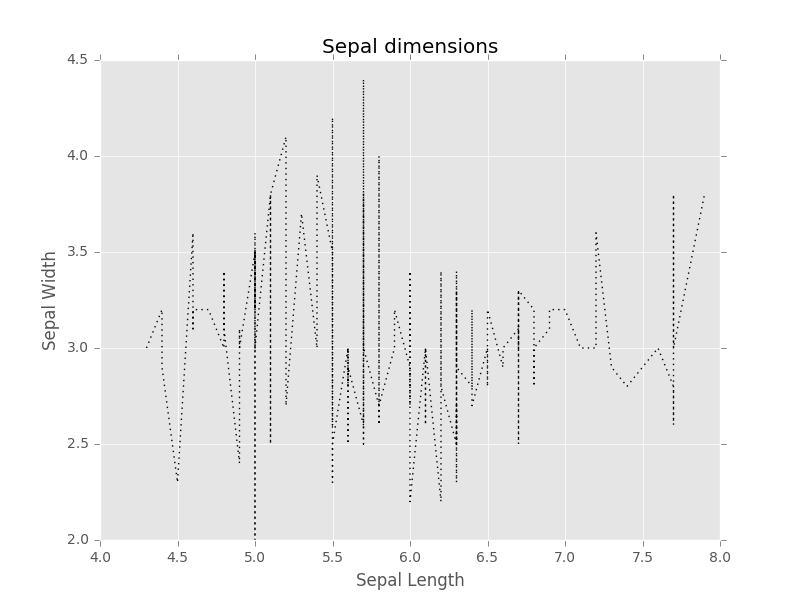
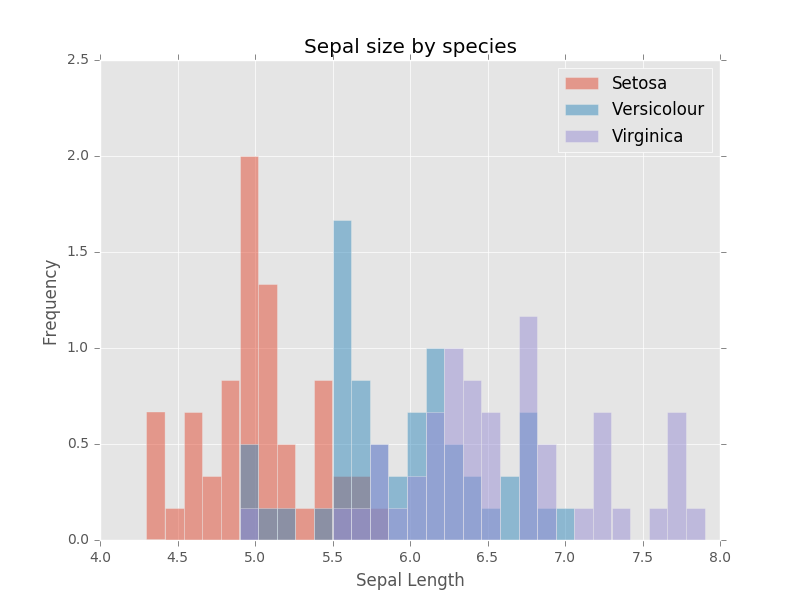
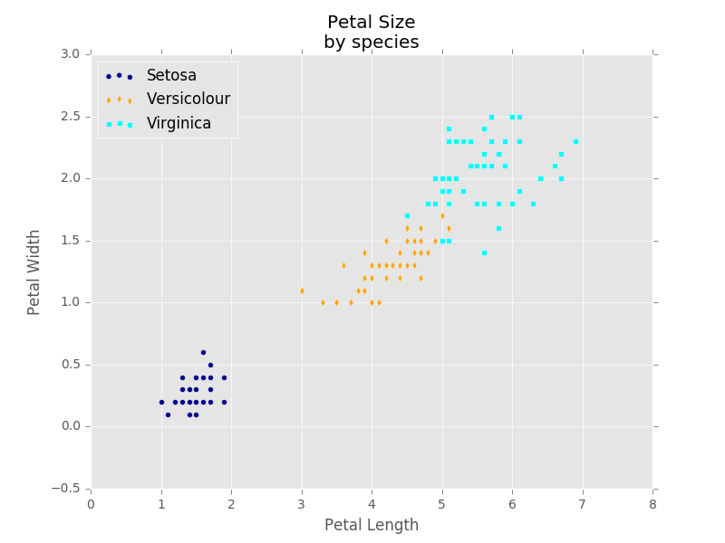
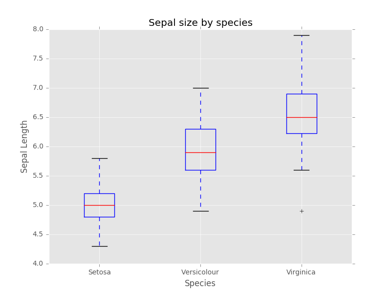
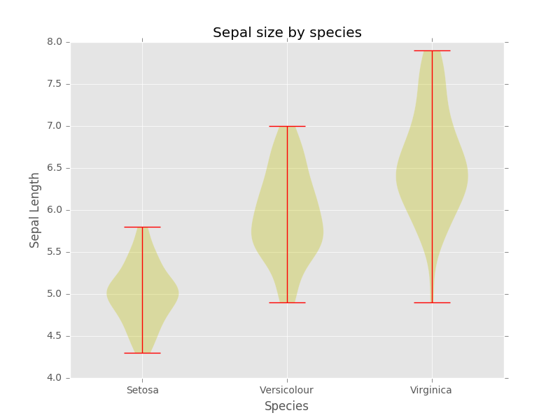
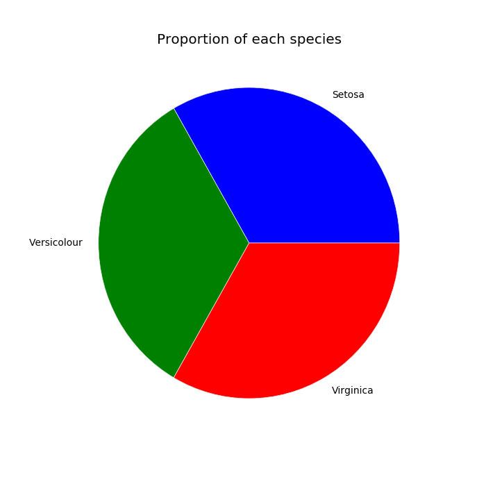
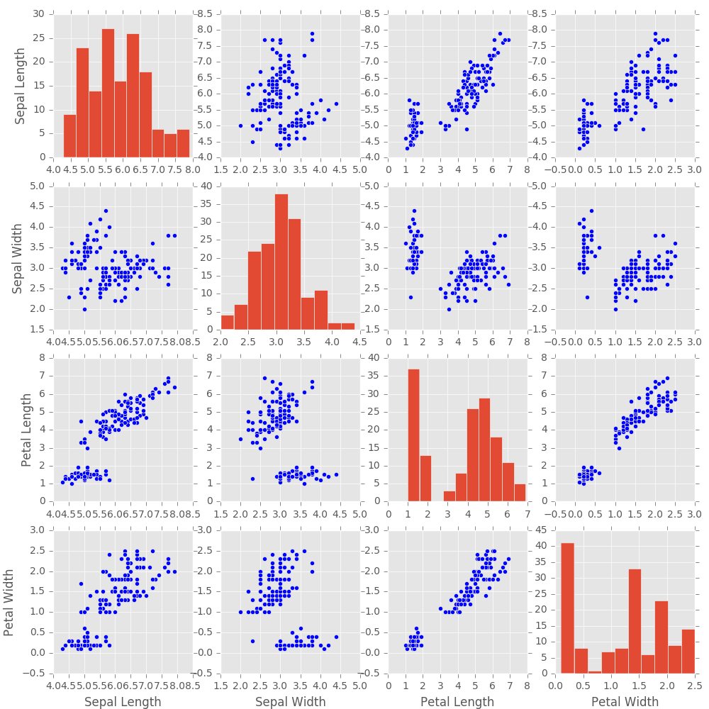
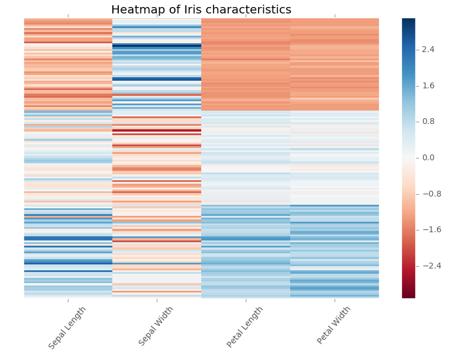
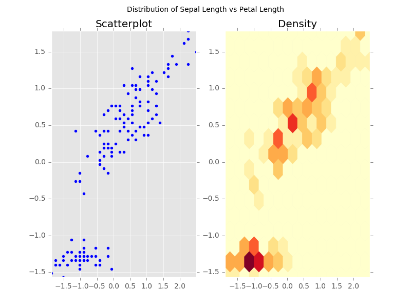

# Matplotlib Pyplot Gallery

For more information on using `matplotlib`, visit the [website](https://matplotlib.org/api/pyplot_summary.html).

For more information about making good figures, read [Ten Simple Rules for Better Figures](http://journals.plos.org/ploscompbiol/article?id=10.1371/journal.pcbi.1003833).

----

## Matplotlib Basics

The basics of generating a plot look like this.

```Python
import matplotlib.pyplot as plt

fig, ax = plt.subplots()
ax.set_title("Descriptive Title Here")
#Your code goes here
fig.savefig("plot.png")
plt.close(fig)
```

#### Generating axes

|||
|:--------------------------------------------|:--------------------------------------------------------|
| `fig, ax = plt.subplots()`                  | Generate a new figure, with one blank axis to plot on.  |
| `fig, (ax1, ax2) = plt.subplots(nrows=2)`   | Generate a new figure, with two blank axes side-by-side.|
| `fig, (ax1, ax2) = plt.subplots(ncols=2)`   | Generate a new figure, with two blank axes stacked.     |
| `fig, axes = plt.subplots(nrows=3, ncols=2)`| Generate a new figure, 2 wide by 3 tall.                |
| `fig, ax = plt.subplots(figsize=(8,6))`     | Generate a new figure, 8 inches wide by 6 inches tall.  |
{:.table.table-striped}

#### Working with labels

|||
|:--------------------------------------------|:--------------------------------------------------------|
| `fig.suptitle("Text")`                      | Set the title of the _whole figure_ to "Text"           |
| `ax.set_title("Text")`                      | Set the title of the _subplot_ to "Text"                |
| `ax.set_xticks(list_of_positions)`          | Specify where you want the tick marks to show up        |
| `ax.set_yticks(list_of_positions)`          | Specify where you want the tick marks to show up        |
| `ax.set_xticklabels(list_of_labels)`        | Specify the labels that show up at each tick mark       |
| `ax.set_yticklabels(list_of_labels)`        | Specify the labels that show up at each tick mark       |
| `ax.set_xlabel("Text")`                     | Label the x-axis "Text"                                 |
| `ax.set_ylabel("Text")`                     | Label the y-axis "Text"                                 |
{:.table.table-striped}

#### Additional objects

|||
|:---------------------------------------------|:--------------------------------------------------------|
| `cbar = fig.colorbar(im, ax=ax, cmap='RdBu')`| Add a colorbar next to `ax`, scaled to the values in plot `im`, colored according to the colormap `RdBu` |
| `l = ax.legend(loc="upper right")`           | Add a legend of the *labeled* objects in the plot to the upper right corner of `ax` |
{:.table.table-striped}

#### Finishing a plot

|||
|:--------------------------------------------|:--------------------------------------------------------|
| `fig.show()`                                | Open an interactive window of your plot.                |
| `fig.savefig("plot.png")`                   | Save your plot to the file `plot.png`. It detects the filetype based on the extension, e.g. png, pdf, ps, svg. |
| `plt.close(fig)`                            | Closes your plot, freeing memory.                       |
{:.table.table-striped}

----

## Gallery

This gallery contains the code to create example plots of the following kinds:


|                                                                                                                                                                                  |                                                                          Plot types                                                                          |                                                                                                                                                    |
|:--------------------------------------------------------------------------------------------------------------------------------------------------------------------------------:|:------------------------------------------------------------------------------------------------------------------------------------------------------------:|:--------------------------------------------------------------------------------------------------------------------------------------------------:|
|                        [Line plot](plot_plot.py) (`plt.plot`) <br/>  [](plot_plot.py)                         |               [Histogram](hist_plot.py) (`plt.hist`) <br/> [](hist_plot.py)               | [Scatter plot](scatter_plot.py) (`plt.scatter`) <br/> [](scatter_plot.py) |
|                   [Box plot](boxplot_plot.py) (`plt.boxplot`)  <br/> [](boxplot_plot.py)                    | [Violin plot](violin_plot.py) (`plt.violinplot`) <br/> [](violin_plot.py) |            [Pie chart](pie_plot.py) (`plt.pie`) <br/> [](pie_plot.py)            |
| [Scatter matrix](scattermatrix_plot.py) (`plt.hist` + `plt.scatter`)  <br/> [](scattermatrix_plot.py) |           [Heatmap](heatmap_plot.py) (`plt.pcolor`) <br/> [](heatmap_plot.py)            |        [Density](hexbin_plot.py) (`plt.hexbin`) <br/> [](hexbin_plot.py)        |
{:.table}
